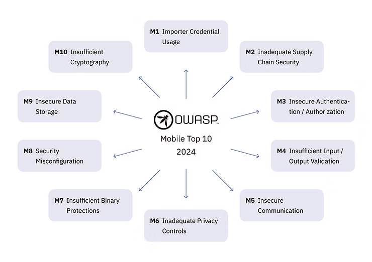

# Tipografia

Sempre usamos a fonte Poppins (apenas) para tópicos de marketing e comunicação externa. Em combinação com as nossas cores, permite-nos ser consistentes e mais facilmente reconhecíveis.

Nós o recusamos em estilos diferentes para criar uma hierarquia visual em nossos ativos.

## Estilo de fonte

<figure><figcaption></figcaption></figure>

Variant: **Poppins Bold**

Light Color: **Blue 800, Blue 900**

Dark Color: **Neutral 0**

Always use Poppins bold for your titles! If you need to highlight a word in your title, you can simply use one of our accent colors.

\

