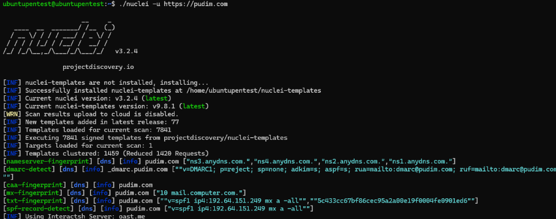
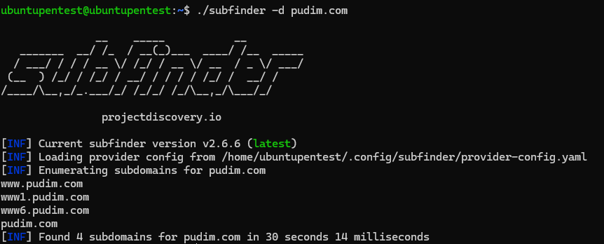
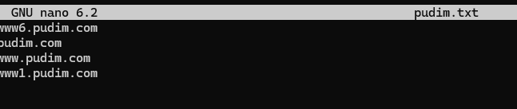
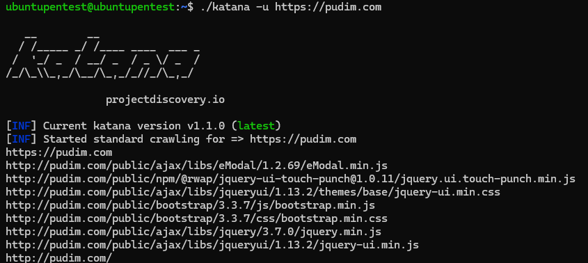
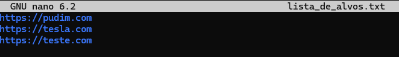
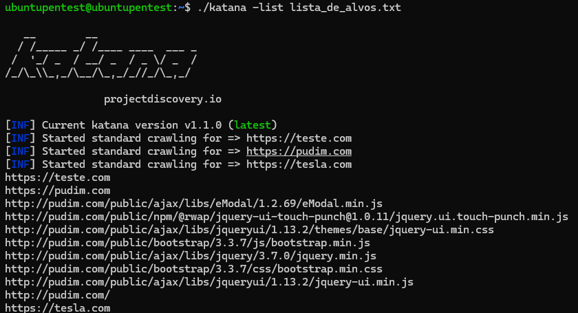

# Automatizando o Scan por Secrets

**ProjectDiscovery** é uma comunidade de Cyber Segurança open source, em que eles criam ferramentas para pessoas que trabalham na área de segurança. Possuem mais de 50 milhões de downloads mensais em mais de 100 países diferentes.&#x20;

Os seus projetos mais famosos são: **Nuclei, Subfinder e Katana.**

<figure><figcaption></figcaption></figure>

**Nuclei**

Nuclei é usado para enviar requisições entre os alvos baseado em um **template**. Com uma média de 0 falsos positivos, ele possui um **scanning rápido** para um grande número de hosts..

Nuclei oferece scanning para uma variedade de protocolos, incluindo TCP, DNS, HTTP, SSL, etc.

Com um poderoso e flexível template, Nuclei pode ser usado para todos os tipos de testes de segurança.


**Como utilizar:**

* Para um único alvo:

```
nuclei -u (domínio)
```

* Alvos que não são HTTPS:

```
nuclei -u (domínio:porta)

```

* Múltiplos Alvos:

```
nuclei -l /caminho_arquivo/arquivo_com_alvos.txt
```

<figure><figcaption></figcaption></figure>

* Para utilizá-lo junto com outras ferramentas:

```
subfinder -d (https://domínio.com) | nuclei -u (https://domínio.com)
```

* Com templates específicas:

```
nuclei -u (https://domínio.com) -t (caminho da pasta)
```

* Com tags específicas:

```
nuclei -u (https://domínio.com) -tags (tags)
```

* Por Severidade:

```
nuclei -u (https://domínio.com) -s critical,high,medium,low
```


**Subfinder**

**Subfinder** é uma ferramenta que retorna **subdomínios ocultos** de um site, usando fontes online passivas. Os subdomínios são importantes para nós, pois neles contém geralmente informações preciosas e muito útil para nós.


* Como utilizar:

```
subfinder -d (domínio.com)
```

<figure><figcaption></figcaption></figure>

* Para salvar as informações em um arquivo:

```
subfinder -d (domínio.com) -o (nome_do_arquivo.txt)
```

<figure><figcaption></figcaption></figure>


**Katana**

**Katana** é uma ferramenta rápida e customizável que tem como objetivo realizar **web crawler**, ou seja, um rastreador de rede, que possa ser usado de forma ativa ou passiva, utilizando o crawl em múltiplos domínios e subdomínios simultaneamente. Seu objetivo é conseguir informações e endpoints.


* Como utilizar:

```
katana -u (https://domínio.com)
```

<figure><figcaption></figcaption></figure>

* Para mais de um domínio:

```
katana -u (https://domínio.com),(https://domínio2.com)
```

* De um arquivo:

```
katana -list (arquivo.txt)
```

<figure><figcaption></figcaption></figure>

<figure><figcaption></figcaption></figure>


**Estas são as três ferramentas mais utilizadas desenvolvidas pela ProjectDiscovery e o modo de usar elas. Para poder acessar mais informações sobre cada tool é só utilizar o comando:**

```
(nome_da_tool) -h
```


**Referências:**

[https://github.com/projectdiscovery](https://github.com/projectdiscoveryhttps://projectdiscovery.iohttps://blog.projectdiscovery.io/ultimate-nuclei-guide/https://rootsec.com.br/subfinder-a-ferramenta-que-descobre-todos-os-subdominios-ocultos/https://blog.projectdiscovery.io/introducing-katana-the-best-cli-web-crawler/https://www.geeksforgeeks.org/katana-crawling-and-spidering-framework/)[
\
https://projectdiscovery.io](https://github.com/projectdiscoveryhttps://projectdiscovery.iohttps://blog.projectdiscovery.io/ultimate-nuclei-guide/https://rootsec.com.br/subfinder-a-ferramenta-que-descobre-todos-os-subdominios-ocultos/https://blog.projectdiscovery.io/introducing-katana-the-best-cli-web-crawler/https://www.geeksforgeeks.org/katana-crawling-and-spidering-framework/)[
\
https://blog.projectdiscovery.io/ultimate-nuclei-guide/](https://github.com/projectdiscoveryhttps://projectdiscovery.iohttps://blog.projectdiscovery.io/ultimate-nuclei-guide/https://rootsec.com.br/subfinder-a-ferramenta-que-descobre-todos-os-subdominios-ocultos/https://blog.projectdiscovery.io/introducing-katana-the-best-cli-web-crawler/https://www.geeksforgeeks.org/katana-crawling-and-spidering-framework/)[
\
https://rootsec.com.br/subfinder-a-ferramenta-que-descobre-todos-os-subdominios-ocultos/](https://github.com/projectdiscoveryhttps://projectdiscovery.iohttps://blog.projectdiscovery.io/ultimate-nuclei-guide/https://rootsec.com.br/subfinder-a-ferramenta-que-descobre-todos-os-subdominios-ocultos/https://blog.projectdiscovery.io/introducing-katana-the-best-cli-web-crawler/https://www.geeksforgeeks.org/katana-crawling-and-spidering-framework/)[
\
https://blog.projectdiscovery.io/introducing-katana-the-best-cli-web-crawler/](https://github.com/projectdiscoveryhttps://projectdiscovery.iohttps://blog.projectdiscovery.io/ultimate-nuclei-guide/https://rootsec.com.br/subfinder-a-ferramenta-que-descobre-todos-os-subdominios-ocultos/https://blog.projectdiscovery.io/introducing-katana-the-best-cli-web-crawler/https://www.geeksforgeeks.org/katana-crawling-and-spidering-framework/)[
\
https://www.geeksforgeeks.org/katana-crawling-and-spidering-framework/](https://github.com/projectdiscoveryhttps://projectdiscovery.iohttps://blog.projectdiscovery.io/ultimate-nuclei-guide/https://rootsec.com.br/subfinder-a-ferramenta-que-descobre-todos-os-subdominios-ocultos/https://blog.projectdiscovery.io/introducing-katana-the-best-cli-web-crawler/https://www.geeksforgeeks.org/katana-crawling-and-spidering-framework/)[
\
](https://github.com/projectdiscoveryhttps://projectdiscovery.iohttps://blog.projectdiscovery.io/ultimate-nuclei-guide/https://rootsec.com.br/subfinder-a-ferramenta-que-descobre-todos-os-subdominios-ocultos/https://blog.projectdiscovery.io/introducing-katana-the-best-cli-web-crawler/https://www.geeksforgeeks.org/katana-crawling-and-spidering-framework/)
