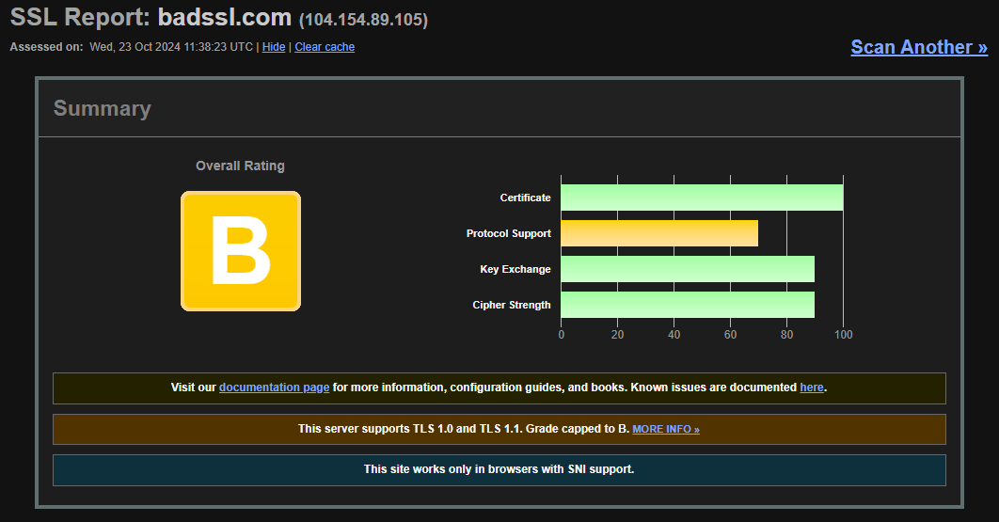
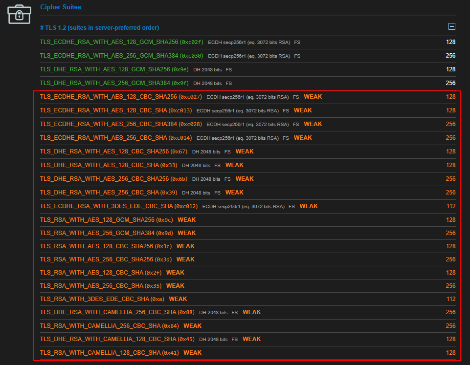

# Low Hanging Fruit

**Checklist Testes Iniciais**

***

> Ausência de Header

Toda vulnerabilidade que envolve a **ausência de cabeçalhos ("header")** deve ser adicionada **separadamente** para cada cabeçalho ausente presente no escopo.


Exemplo de como deve ser evidenciado a Ausência do Header:

<figure><figcaption><p>Figura: Request Burp Suite</p></figcaption></figure>


<figure><figcaption><p>Figura: Response Burp Suite indicando a ausência do header</p></figcaption></figure>


Por **padrão** os Headers são reportados pelas seguintes severidades:

<figure><figcaption><p>Figura: Severidade de cada cabeçalho</p></figcaption></figure>


Isto é apenas uma **indicação**, porém a severidade de cada cabeçalho deve ser indicado mediante o **impacto** que ele traz ao ambiente testado.


***

> **Js.map**

É uma ótima forma de investigarmos mais sobre a estrutura do site, através de seu código JavaScript.

Primeiro devemos entrar no código fonte da aplicação pressionando CTRL + U, dentro dela iremos procurar por arquivos Javascript.

Iremos buscar sempre o final "js.map" de arquivos como "main" e "app".

Dentro deles iremos procurar no final se contém "js.map".

Então vamos usar uma ferramenta chamada "unwebpack-sourcemap", através dela usamos o seguinte código como exemplo:

```
python3 unwebpack_sourcemap.py --make-directory 
https://example.com/assets/UserNameComplete-d6c0c7fc8bc309d9b022.js.map 
output
```

Depois de rodar esta ferramenta, iremos visualizar o frontend completo desta maneira:

<figure><figcaption><p>Figura: Frontend divido em diretórios</p></figcaption></figure>

Assim iremos ver de forma mais simples e organizada toda a estrutura frontend da aplicação e podemos examinar diversas coisas, como: se possui comentários do Dev sobre senhas, API,  o que aquilo faz e entender melhor sobre a estrutura.


***

> **Medidas de anti-adulteração de bibliotecas Javascript não estão em uso (Integrity)**

**Descrição:**

Descrição da integridade do **Sub-recurso** Medidas de detecção de adulteração, como _Subresource Integrity (SRI)_, podem identificar quando um arquivo JavaScript externo importado por um aplicativo foi adulterado por **terceiros mal-intencionados.**

Se não forem obtidos de forma segura, esses arquivos podem ser modificados por invasores para obter **controle** sobre a funcionalidade do arquivo e, portanto, **executar código malicioso** no navegador do usuário usando os privilégios de um site válido.

Vários hackers de roubo de informações de alto nível (em particular contra a British Airways) exploraram esse problema de forma muito eficaz para comprometer **informações confidenciais dos clientes.**

**Então**, procure referências a javascript que não tenha a flag.

**Exemplo:**

<figure><figcaption><p>Figura: Exemplo correto com SHA384</p></figcaption></figure>

**Segue o código abaixo:**

```
integrity="sha384-oqVuAfXRKap7fdgcCY5uykM6+R9GqQ8K/uxy9rx7HNQlGYl1kPzQho
1wx4JwY8wC"
```

***

> **SSL/TLS**

São protocolos de segurança que garantem que a navegação do usuário fique protegida contra um possível vazamento de dados e ataques hackers. Ou seja, toda a informação sensível compartilhada pelo usuário, se mantém criptografada.

Ambos o SSL quanto o TLS, são muito parecidos, porém o TLS é uma versão mais atualizada do SSL.

**TLS:**

**Transport Layer Security**, este protocolo vai codificando toda a mensagem que o usuário envia ao servidor, e são criados chaves de acesso a qual apenas o emissor e receptor tem acesso e quando a informação faz esse caminho, o TLS autentica quem tentou acessar o conteúdo, caso não seja um dos dois, não é possível acessar a mensagem.&#x20;

O protocolo TLS é mais eficaz que o protocolo SSL.


Através disto iremos procurar aplicações que contenham cifras fracas, com isso podemos usar o site a seguir:


ssllabs.com/ssltest/


<figure><figcaption><p>Figura: Classificação</p></figcaption></figure>


<figure><figcaption><p>Figura: Cifras fracas</p></figcaption></figure>

***

> **Vulnerabilidade da Versão do Server**

Ocorre quando a aplicação divulga informações que podem ajudar um atacante, como a **versão do server** que é utilizada, em que através desta informação, pode-se buscar um exploit para aquela versão e depois utilizar-se deste exploit para fazer a invasão.

Podemos ver no exemplo abaixo, uma aplicação em que divulga a informação da versão do server (nginx 1.18):


<figure><figcaption><p>Figura: Exposição da versão do Servidor</p></figcaption></figure>

***

> **Portas Abertas**

Para descobrirmos as portas que estão abertas e quais serviços estão rodando, utilizamos o NMAP.

Nele podemos especificar muitas coisas, como quais portas queremos fazer o teste, Scan UDP, TCP, versão do serviço, tipo de sistema operacional, etc

Para rodarmos um scan simples, usamos:

```
nmap (endereço)
```

Um scan mais completo seria:

```
nmap -Pn -sS -p- (endereço)
```


<figure><figcaption><p>Figura: Resultado scan NMAP</p></figcaption></figure>


***

> **Nuclei / Katana**

**Nuclei:**

Nuclei é usado para enviar requisições entre os alvos baseado em um **template**. Com uma média de 0 falsos positivos, ele possui um **scanning rápido** para um grande número de hosts.


**Exemplo de como utilizar:**

```
nuclei -u (domínio)
```

<figure><figcaption><p>Figura: Resultado scan com Nuclei</p></figcaption></figure>


**Katana:**

**Katana** é uma ferramenta rápida e customizável que tem como objetivo realizar **web crawler**, e que possa ser usado de forma ativa ou passiva, utilizando o crawl em múltiplos domínios e subdomínios simultaneamente. Seu objetivo é conseguir informações e endpoints.


**Exemplo de como utilizar:**

```
katana -u (domínio)
```


<figure><figcaption><p>Figura: Resultado scan com Katana</p></figcaption></figure>


***

> **Política de Senhas Permissivas**

Trata-se de quando a aplicação **permite** que o usuário utilize senhas simples e fracas para cadastrar-se, fazendo com que a segurança da aplicação seja mais baixa.

Uma boa política de senhas é aquela em que requer no mínimo 8 caracteres, caracteres especiais, letras maiúsculas e minúsculas... Tornando a senha mais complexa e mais difícil do atacante quebrar.


**Exemplo de uma boa política de senhas:**

<figure><figcaption><p>Figura: Requisitos mínimos de senha para cadastro</p></figcaption></figure>


***

> **Mensagem de Erros**

Quando a aplicação retorna um **erro inesperado** assim que um evento acontece, conforme o retorno que a aplicação der em relação ao erro, o atacante pode entender melhor como funciona a estrutura da aplicação, podendo aproveitar-se de alguma vulnerabilidade que pode ser exposta com o erro.

<figure><figcaption><p>Figura: Erro de Aplicação</p></figcaption></figure>


***

> **Utilizar bibliotecas JavaScript desatualizadas**

Para encontrar esta vulnerabilidade entramos no código fonte da aplicação, procuramos por arquivos JavaScript, como o **"JQuery"** e sua versão, através desta sua versão um atacante pode buscar por suas vulnerabilidades e explorar uma vulnerabilidade.

**Exemplo:**

<figure><figcaption><p>Figura: Versão JQuery no Código Fonte</p></figcaption></figure>


***

> **Enumeração de Usuário**

Ocorre geralmente na área de login, cadastro ou esqueci a senha, em que quando digitamos algum usuário e senha, a aplicação nos retorna que o usuário já existe, ou que o email não está cadastrado, fazendo com que o atacante consiga enumerar quais usuários/emails são válidos ou não.

Porém o mesmo pode ser encontrado em outras partes da aplicação, como por exemplo alguma aba de alterar o e-mail do usuário dentro da plataforma, pode haver de constar que o e-mail já está cadastrado.

A mensagem correta que a aplicação deve retornar é de **"Usuário ou Senha Incorretos"** ou **"Caso o email já estiver cadastrado você receberá um link na sua caixa de email"**&#x20;


***

> **Uso de IDs sequenciais**

Praticamente qualquer sistema moderno tem referências direta a objetos. Este comportamento faz com algumas aplicações utilizem IDs sequenciais, ou seja, se há um objeto de ID 5, o próximo será 6 e assim por diante.

A partir disto pode-se tornar uma vulnerabilidade maior como por exemplo um IDOR.

Uma boa prática é a utilização de algoritmos modernos como _UUID v4_ para mitigar esta vulnerabilidade.


***

> **Upload irrestrito de arquivos**

Algumas aplicações possuem funcionalidades de subir arquivos, seja para alterar a foto de perfil, enviar algum documento ou qualquer outra função, porém se a mesma não for sanitizada corretamente é possível fazer o upload de algum arquivo malicioso para realizar diversas ações não autorizadas dentro da aplicação, como abrir uma shell com um arquivo **.php,** executar um arquivo **.exe**, exploit _client-side based_ com um **.html**, etc.


***

> **Registro e monitoramento insuficiente de atividades**

Quando uma aplicação possuir _logs_, deve-se verificar caso a mesma esteja realmente capturando todas as informações que ocorrem na aplicação, pois pode ocorrer de a mesma estar apenas registrando algumas atividades ou refletindo apenas **informações parciais**, o que é uma implicação de **segurança e auditoria**.


***

> **Negação de serviço através de múltiplas tentativas de login**

Algumas aplicações impõem (ou não) bloqueio na conta depois de um número de tentativas de acesso, porém muitas vezes esse número pode ser muito grande, permitindo que o atacante tente múltiplas tentativas antes de ser bloqueado, o que também permite um possível ataque de negação de serviço em conjunto.


***

> **Falta de validação na alteração de dados**

Quando requisitado alguma alteração dentro da área logada, como: **alterar a senha, e-mail ou algum dado pessoal**, a aplicação deve realizar alguma **validação**, que pode ser: requisitar a senha novamente, algum _challenge_ para resolver, e-mail de confirmação, etc.

Caso não haja nenhuma validação é considerado como uma vulnerabilidade.


***

> **Validação de input insuficiente**

Esta vulnerabilidade ocorre quando a aplicação não valida corretamente a entrada de dados fornecidos pelos usuários, por exemplo, ao criar uma conta, não é validado o e-mail informado, número de telefone ou outro dado solicitado.

Permitindo assim de que haja a criação de contas com dados fictícios ou inválidos e sem a validação adequada, as políticas implementadas, como de senhas fortes, formatos de e-mail, entre outros se tornam ineficazes.


***

> **Validação de registro de dados pessoais**

A vulnerabilidade se remete quando no registro de conta de usuário e é requisitado dados pessoais como CPF, o mesmo deve validar se o CPF inserido é válido (formato) e também se é verdadeiro, ou seja, condiz com as informações subsequentes registradas.


***

> **Invalidação do link de redefinição de senha**

Quando clicado em "Esqueci a senha", o link enviado deve ser inválidado após o uso, ou seja, depois de ter trocado a senha, o mesmo link não deve funcionar mais para alterar a senha novamente, a aplicação deve gerar um novo link caso o usuário queira redefinir novamente a senha.


***

> **Host header injection**

É quando clicado em "Esqueci a senha", depois ao apertar para enviar a requisição, interceptamos ela e trocar o header "Host" por outro site, caso não redirecionar para lá, mantemos o header Host original e adicionamos abaixo dele o header "X-Forwarded-Host" com o outro site.

Para aumentar a severidade, caso a aplicação seja vulnerável, podemos redirecionar para algum server que temos controle para capturar o token do usuário, possibilitando assim que alteramos a senha do mesmo e ganhamos controle sobre a conta.


***

> **Flood de e-mail por meio de redefinição de senha**

Para realizar o teste dessa vulnerabilidade, devemos: entrar na aba esqueci minha senha, depois inserir o e-mail e interceptar o request quando apertado o botão de enviar, assim com este request, jogamos no repeater e ficamos enviando a mesma requisição diversas vezes, caso todas foram aceitas, irá gerar um flood de e-mails na caixa de entrada do usuário.


***

> **Redirecionamento HTTP**&#x20;

Esta vulnerabilidade ocorre quando realizado uma requisição para a aplicação com **HTTP** ao invés de **HTTPS**, a maneira recomendada é a aplicação fazer o redirecionamento, caso não fizer, a aplicação encontra-se vulnerável.


***

> **Acesso via IP diretamente**

Ao identificar o endereço IP da aplicação, realize uma requisição com o endereço IP, caso a aplicação não faça o redirecionamento para o endereço DNS a mesma se encontra vulnerável a alguns ataques como bypass de WAF.


***

> **Aplicação mostrando hash de senha**

Identificar se a aplicação em alguma rota demonstra o hash de senha do usuário, caso ocorrer, identificar o tipo de hash e se o mesmo possui algum tipo de _salt_.

Para identificar se possui ou não o _salt_, basta codificar a senha inserida no mesmo formato do hash, caso os dois hashes se apresentarem diferente um do outro significa que a aplicação utiliza alguma forma de _salt_ para proteger os hashes de senha.


***

> **Verificações no JWT**

Verificar o que há dentro do token JWT, deve ser reportado caso o token apresente: Criptografia fraca ou dados pessoais e informações sensíveis.

Para verificar basta acessar:&#x20;

[JWT](https://jwt.io)


***

> **Cookie de sessão sem a flag Secure habilitada**

Verificar se o cookie de sessão possui a flag Secure.


***

> **Cookie de sessão sem a flag HttpOnly habilitada**

Verificar se o cookie de sessão possui a flag HttpOnly.


***

> Upload de arquivos

Testar se é possível subir uma extensão de arquivo diferente da qual a aplicação aceita, ex: caso aceite apenas .png, testar subir um .exe,. rar, etc.


