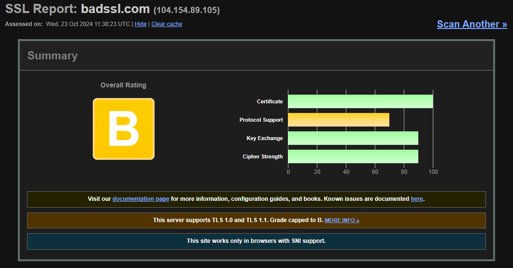
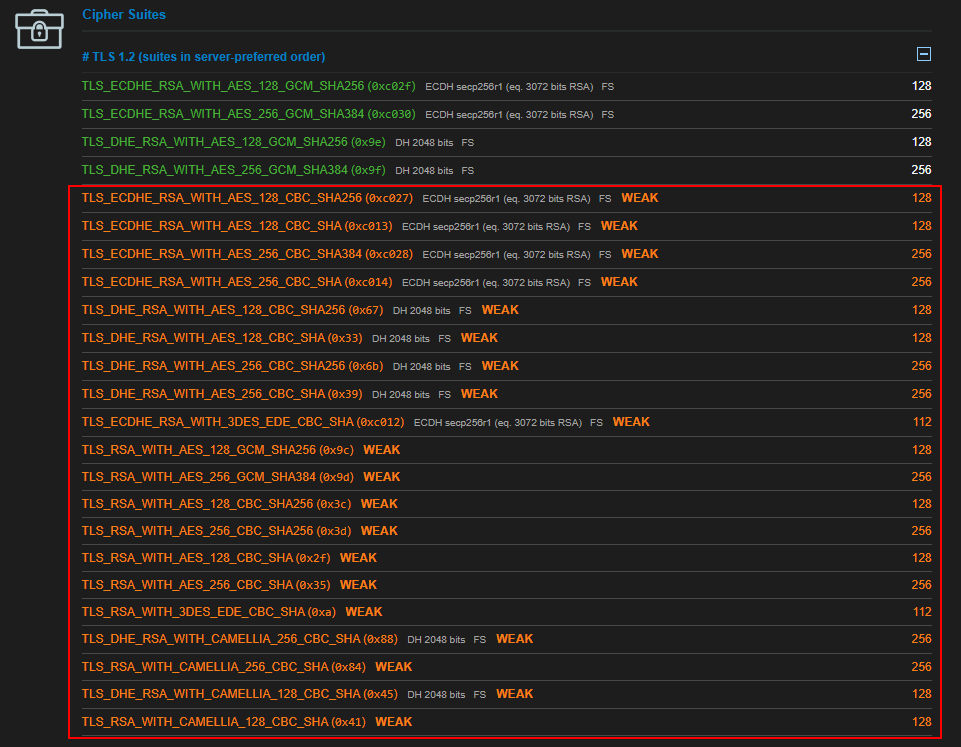

# Low Hanging Fruits

> **Ausência de cabeçalho**

Toda vulnerabilidade que envolve a **ausência de cabeçalhos ("header")** deve ser adicionada **separadamente** para cada cabeçalho ausente presente no escopo.


Exemplo de como deve ser evidenciado a Ausência do Header:

<figure><figcaption><p>Figura: Request Burp Suite</p></figcaption></figure>


<figure><figcaption><p>Figura: Response Burp Suite indicando a ausência do header</p></figcaption></figure>


Por **padrão** os Headers são reportados pelas seguintes severidades:

<figure><figcaption><p>Figura: Severidade de cada cabeçalho</p></figcaption></figure>

Isto é apenas uma **indicação**, porém a severidade de cada cabeçalho deve ser indicado mediante o **impacto** que ele traz ao ambiente testado.


***

> **Js.map**

É uma ótima forma de investigarmos mais sobre a estrutura do site, através de seu código JavaScript.

Primeiro devemos entrar no código fonte da aplicação pressionando CTRL + U, dentro dela iremos procurar por arquivos Javascript.

Iremos buscar sempre o final "js.map" de arquivos como "main" e "app".

Dentro deles iremos procurar no final se contém "js.map".

Então vamos usar uma ferramenta chamada "[decompile\_sourcemap](https://github.com/vanticohq/decompile_sourcemap/tree/main)", através dela usamos o seguinte código como exemplo:

```
python3 decompile_sourcemap.py 
https://example.com/assets/UserNameComplete-d6c0c7fc8bc309d9b022.js.map 
(nome_da_pasta)
```

Em que "(nome\_da\_pasta)" é a pasta que a ferramenta irá criar com o arquivo js.map.

Depois de rodar esta ferramenta, iremos visualizar o frontend completo desta maneira:

<figure><figcaption><p>Figura: Frontend divido em diretórios</p></figcaption></figure>

Assim iremos ver de forma mais simples e organizada toda a estrutura frontend da aplicação e podemos examinar diversas coisas, como: se possui comentários do Dev sobre senhas, API,  o que aquilo faz e entender melhor sobre a estrutura.


***

> **Medidas de anti-adulteração de bibliotecas Javascript não estão em uso (Integrity)**

**Descrição:**

Descrição da integridade do **Sub-recurso** Medidas de detecção de adulteração, como _Subresource Integrity (SRI)_, podem identificar quando um arquivo JavaScript externo importado por um aplicativo foi adulterado por **terceiros mal-intencionados.**

Se não forem obtidos de forma segura, esses arquivos podem ser modificados por invasores para obter **controle** sobre a funcionalidade do arquivo e, portanto, **executar código malicioso** no navegador do usuário usando os privilégios de um site válido.

Vários hackers de roubo de informações de alto nível (em particular contra a British Airways) exploraram esse problema de forma muito eficaz para comprometer **informações confidenciais dos clientes.**

**Então**, procure referências a javascript que não tenha a flag.

**Exemplo:**

<figure><figcaption><p>Figura: Exemplo correto com SHA384</p></figcaption></figure>

**Segue o código abaixo:**

```
integrity="sha384-oqVuAfXRKap7fdgcCY5uykM6+R9GqQ8K/uxy9rx7HNQlGYl1kPzQho
1wx4JwY8wC"
```

***

> **SSL/TLS**

São protocolos de segurança que garantem que a navegação do usuário fique protegida contra um possível vazamento de dados e ataques hackers. Ou seja, toda a informação sensível compartilhada pelo usuário, se mantém criptografada.

Ambos o SSL quanto o TLS, são muito parecidos, porém o TLS é uma versão mais atualizada do SSL.

**TLS:**

**Transport Layer Security**, este protocolo vai codificando toda a mensagem que o usuário envia ao servidor, e são criados chaves de acesso a qual apenas o emissor e receptor tem acesso e quando a informação faz esse caminho, o TLS autentica quem tentou acessar o conteúdo, caso não seja um dos dois, não é possível acessar a mensagem.&#x20;

O protocolo TLS é mais eficaz que o protocolo SSL.


Através disto iremos procurar aplicações que contenham cifras fracas, com isso podemos usar o site a seguir:


ssllabs.com/ssltest/


<figure><figcaption><p>Figura: Classificação</p></figcaption></figure>


<figure><figcaption><p>Figura: Cifras fracas</p></figcaption></figure>

***

> **Vulnerabilidade da Versão do Server**

Ocorre quando a aplicação divulga informações que podem ajudar um atacante, como a **versão do server** que é utilizada, em que através desta informação, através dessa informação, deve ser realizado uma busca pelo [endoflife](https://endoflife.date/) do serviço e se o mesmo possui vulnerabilidades conhecidas (CVEs).

Podemos ver no exemplo abaixo, uma aplicação em que divulga a informação da versão do server (nginx 1.18):


<figure><figcaption><p>Figura: Exposição da versão do Servidor</p></figcaption></figure>

***

> **Política de Senhas Permissivas**

Trata-se de quando a aplicação **permite** que o usuário utilize senhas simples e fracas para cadastrar-se, fazendo com que a segurança da aplicação seja mais baixa.

Uma boa política de senhas é aquela em que requer no mínimo 10 caracteres, caracteres especiais, letras maiúsculas e minúsculas e números. Tornando a senha mais complexa e mais difícil do atacante quebrar.


**Exemplo de uma boa política de senhas:**

<figure><figcaption><p>Figura: Requisitos mínimos de senha para cadastro</p></figcaption></figure>


***

> **Mensagem de Erros**

Quando a aplicação retorna um **erro inesperado** assim que um evento acontece, conforme o retorno que a aplicação der em relação ao erro, o atacante pode entender melhor como funciona a estrutura da aplicação, podendo aproveitar-se de alguma vulnerabilidade que pode ser exposta com o erro.

<figure><figcaption><p>Figura: Erro de Aplicação</p></figcaption></figure>


***

> **Utilizar bibliotecas JavaScript desatualizadas**

Para encontrar esta vulnerabilidade entramos no código fonte da aplicação, procuramos por arquivos JavaScript, como o **"JQuery"** e sua versão, através desta sua versão um atacante pode buscar por suas vulnerabilidades e explorar uma vulnerabilidade.

**Exemplo:**

<figure><figcaption><p>Figura: Versão JQuery no Código Fonte</p></figcaption></figure>


***

> **Enumeração de Usuário**

Ocorre geralmente na área de login, cadastro ou esqueci a senha, em que quando digitamos algum usuário e senha, a aplicação nos retorna que o usuário já existe, ou que o email não está cadastrado, fazendo com que o atacante consiga enumerar quais usuários/emails são válidos ou não.

Porém o mesmo pode ser encontrado em outras partes da aplicação, como por exemplo alguma aba de alterar o e-mail do usuário dentro da plataforma, pode haver de constar que o e-mail já está cadastrado.

A mensagem correta que a aplicação deve retornar é de **"Usuário ou Senha Incorretos"** ou **"Caso o email já estiver cadastrado você receberá um link na sua caixa de email"** .

A enumeração também pode ser identificada via _time-based_, ou seja, por tempo de resposta, ocorre quando o tempo de resposta quando inserido um usuário válido e inválido são muito diferentes.


***

> **Falsificação de e-mails**

Verificar se há falhas no DMARC ou SPF do domínio. Como por exemplo no DMARC, possuir algum valor no "p=" diferente de "reject;".

Enquanto no SPF, caso possua "\~all" ao invés de "-all".


***

> **Sessão antiga não é invalidada após logout**

Para testar essa vulnerabilidade, enquanto logado na aplicação, deve ser capturado requisição e em seguida realizado o logout, após isto, a requisição capturada anteriormente deve ser repetida a fim de identificar se a mesma ainda funciona ou se o token já foi invalidado.


***

> **Ausência de mecanismo contra força bruta**

Essa vulnerabilidade deve ser testada em diferentes campos, como login, redefinição de senha e MFA.

Login: Deve ser testado se há algum controle anti automação ao inserir o mesmo e-mail porém com diversas senhas em um curto período de tempo.

Redefinição de senha: Verificar se possui algum mecanismo ao inserir diversos e-mails no campo.

MFA: Validar se pode ser realizado ataques de força bruta no campo de código do MFA a fim de descobrir a combinação certa para realizar o bypass do mecanismo.


***

> **Uso de IDs sequenciais**

Praticamente qualquer sistema moderno tem referências direta a objetos. Este comportamento faz com algumas aplicações utilizem IDs sequenciais, ou seja, se há um objeto de ID 5, o próximo será 6 e assim por diante.

A partir disto pode-se tornar uma vulnerabilidade maior como por exemplo um IDOR.


***

> **Upload irrestrito de arquivos**

Algumas aplicações possuem funcionalidades de subir arquivos, seja para alterar a foto de perfil, enviar algum documento ou qualquer outra função, porém se a mesma não for sanitizada corretamente é possível fazer o upload de algum arquivo malicioso para realizar diversas ações não autorizadas dentro da aplicação, como abrir uma shell com um arquivo **.php,** executar um arquivo **.exe**, exploit _client-side based_ com um **.html**, etc.


***

> **Upload de arquivos sem limite de tamanho**

Em alguma funcionalidade de upload de arquivos, deve ser enviado um arquivo com um tamanho maior do que o comum (1GB por exemplo), a fim de verificar se o mesmo vai ser realizado ou não o upload. O envio de um arquivo deste tamanho em algumas aplicações pode causar uma indisponibilidade temporária.


***

> **Registro e monitoramento insuficiente de atividades**

Quando uma aplicação possuir _logs_, deve-se verificar caso a mesma esteja realmente capturando todas as informações que ocorrem na aplicação, pois pode ocorrer de a mesma estar apenas registrando algumas atividades ou refletindo apenas **informações parciais**, o que é uma implicação de **segurança e auditoria**.


***

> **Negação de serviço através de múltiplas tentativas de login**

Algumas aplicações impõem (ou não) bloqueio na conta depois de um número de tentativas de acesso, porém muitas vezes esse número pode ser muito grande, permitindo que o atacante tente múltiplas tentativas antes de ser bloqueado, o que também permite um possível ataque de negação de serviço em conjunto.


***

> **Falta de validação na alteração de dados**

Quando requisitado alguma alteração dentro da área logada, como: **alterar a senha, e-mail ou algum dado pessoal**, a aplicação deve realizar alguma **validação**, que pode ser: requisitar a senha novamente, algum _challenge_ para resolver, e-mail de confirmação, etc.

Caso não haja nenhuma validação é considerado como uma vulnerabilidade.


***

> **Validação de input insuficiente**

Esta vulnerabilidade ocorre quando a aplicação não valida corretamente a entrada de dados fornecidos pelos usuários, por exemplo, ao criar uma conta, não é validado o e-mail informado, número de telefone ou outro dado solicitado.

Permitindo assim de que haja a criação de contas com dados fictícios ou inválidos e sem a validação adequada, as políticas implementadas, como de senhas fortes, formatos de e-mail, entre outros se tornam ineficazes.


***

> **Validação de registro de dados pessoais**

A vulnerabilidade se remete quando no registro de conta de usuário e é requisitado dados pessoais como CPF, o mesmo deve validar se o CPF inserido é válido (formato) e também se é verdadeiro, ou seja, condiz com as informações subsequentes registradas.


***

> **Invalidação do link de redefinição de senha**

Quando clicado em "Esqueci a senha", o link enviado deve ser inválidado após o uso, ou seja, depois de ter trocado a senha, o mesmo link não deve funcionar mais para alterar a senha novamente, a aplicação deve gerar um novo link caso o usuário queira redefinir novamente a senha.


***

> **Host header injection**

É quando clicado em "Esqueci a senha", depois ao apertar para enviar a requisição, interceptamos ela e trocar o header "Host" por outro site, caso não redirecionar para lá, mantemos o header Host original e adicionamos abaixo dele o header "X-Forwarded-Host" com o outro site.

Para aumentar a severidade, caso a aplicação seja vulnerável, podemos redirecionar para algum server que temos controle para capturar o token do usuário, possibilitando assim que alteramos a senha do mesmo e ganhamos controle sobre a conta.


***

> **Flood de e-mail por meio de redefinição de senha**

Para realizar o teste dessa vulnerabilidade, devemos: entrar na aba esqueci minha senha, depois inserir o e-mail e interceptar o request quando apertado o botão de enviar, assim com este request, jogamos no repeater e ficamos enviando a mesma requisição diversas vezes, caso todas foram aceitas, irá gerar um flood de e-mails na caixa de entrada do usuário.


***

> **Redirecionamento HTTP**&#x20;

Esta vulnerabilidade ocorre quando realizado uma requisição para a aplicação com **HTTP** ao invés de **HTTPS**, a maneira recomendada é a aplicação fazer o redirecionamento, caso não fizer, a aplicação encontra-se vulnerável.


***

> **Acesso via IP diretamente**

Ao identificar o endereço IP da aplicação, realize uma requisição com o endereço IP, caso a aplicação não faça o redirecionamento para o endereço DNS a mesma se encontra vulnerável a alguns ataques como bypass de WAF.


***

> **Aplicação mostrando hash de senha**

Identificar se a aplicação em alguma rota demonstra o hash de senha do usuário, caso ocorrer, identificar o tipo de hash e se o mesmo possui algum tipo de _salt_.

Para identificar se possui ou não o _salt_, basta codificar a senha inserida no mesmo formato do hash, caso os dois hashes se apresentarem diferente um do outro significa que a aplicação utiliza alguma forma de _salt_ para proteger os hashes de senha.


***

> **Verificações no JWT**

Verificar o que há dentro do token JWT, deve ser reportado caso o token apresente: Criptografia fraca ou dados pessoais e informações sensíveis.


***

> **Página web armazenando credenciais sem criptografia**

Podemos validar essa vulnerabilidade ao entrar em algum arquivo de javascript presente, dessa maneira devemos buscar alguma credencial exposta em texto claro.


***

> **Cookie de sessão sem a flag Secure habilitada**

Verificar se o cookie de sessão possui a flag Secure.


***

> **Cookie de sessão sem a flag HttpOnly habilitada**

Verificar se o cookie de sessão possui a flag HttpOnly.


***

> **Gerenciamento de patch insuficiente**

Identificado a versão do produto, buscar CVEs relacionadas e o EndOfLife do produto ([https://endoflife.date/](https://endoflife.date/)).


***

> **Ausência do arquivo robots.txt**

Buscar na aplicação o endpoint robots.txt, caso retornado 404 e não demonstrado o campo, a aplicação encontra-se com a falta deste mecanismo.


***

> **Ausência de WAF**

Identificar se a aplicação possui algum mecanismo de WAF presente.


***

> **Flood em páginas com brute force**

Esta vulnerabilidade se refere a realizar flood em partes específicas da aplicação, como por exemplo: A aplicação possui um campo de criar postagens, neste caso, deve ser realizado um teste de fazer um flood de postagens.


***

> **Ausência de notifcação por login suspeito**

O sistema não envia nenhum alerta ao titular da conta quando ocorre um login considerado suspeito, por exemplo, de um endereço IP ou localização geográfica nunca antes observados, dispositivo/user‑agent diferente, horário incomum ou após diversas tentativas falhas.


***

> **Subdomínios apontando para IPs privados**

Devemos testar se subdomínios da aplicação apontam para endereços privados, para testar isto basta realizar um dig no subdomínio. Caso vulnerável a aplicação pode estar vulnerável a _DNS Rebinding_.


***

> **DoS JWT**

Em um campo onde inserimos o e-mail e a partir dele é criado um token JWT (de acordo com o e-mail), inserimos um e-mail com diversos caracteres a fim de causar lentidão no momento de geração do token, levando a um possível DoS através do JWT.


***

> **CORS Miconfiguration**

Fazer verificações no CORS para validar se o mesmo está muito permissivo e se encontra vulnerável a ataques.


***

> **Falta de e-mail de verificação no processo de registro**

Validar se durante o processo de registro, é enviado algum e-mail de verificação ao e-mail cadastrado.


***

> **Invalidação da sessão após troca de senha**

Verificar se ao trocar a senha do usuário a sessão é invalidada. Para testar basta: Capturar uma requisição autenticada, em seguida fazer a troca de senha da conta utilizada, depois repetir a requisição capturada.


***

> **Ausência de segundo fator de autenticação no procedimento de login**

Quando realizado o login na aplicação a mesma deve haver a opção do usuário ativar o segundo fator de autenticação (MFA).


***

> **Exposição de metadados em imagens**

Durante o upload de imagens, o sistema deve garantir a remoção dos metadados EXIF antes do armazenamento ou exibição do arquivo. Esses metadados podem conter informações sensíveis, como coordenadas GPS, modelo e marca do dispositivo, data e hora da captura, dados de software e outros detalhes capazes de comprometer a privacidade do usuário.


***

> **Uso de cabeçalho depreciado**

Verificar se a aplicação apresenta cabeçalhos depreciados, como X-Frame-Options, X-XSS-Protection ou Feature-Policy.&#x20;

Essa validação pode ser feita em conjunto com a identificação da ausência de cabeçalhos.


***

> **Divulgação de informações no cabeçalho HTTP**

Outra vulnerabilidade sobre cabeçalhos, esta no caso é quando a aplicação divulga informações como tecnologias, server, no cabeçalho HTTP. Em alguns casos é encontrado como:

_Server: Apache/2.4.52 (Ubuntu)_


***

> **Roubo  de conta via redefinição de senha**

Em um campo de redefinição de senha, podemos testar algumas combinações com o intuito de o link de redefinição de senha ou código ser enviado para ambos os usuários (usuário válido e atacante). Algumas das formas são.

Requisição original:

_{"email":"vitima@pentest.com"}_

Requisição modificada:

_{"email":\["vitima@pentest.com","pentester@pentest.com"]}_

Dessa forma, caso vulnerável o e-mail de redefinição será enviado para a vítima e para o atacante.


***

> **Força bruta na assinatura do token JWT**

Caso a aplicação possua tokens JWT, o mesmo deve ser copiado e enviado para tentar quebrá-lo, a fim de obter o valor do _secret_ e assim poder forjar tokens.

Para quebrar podemos utilizar o _hashcat_, seguindo o formato a seguir.

_hashcat -a 0 -m 16500 token.txt wordlist.txt_&#x20;


***

> **Exposição de chaves API**

Há casos em que dentro de arquivos JavaScript podem ser encontrados credenciais, chaves API e outras informações interessantes, deve sempre verificar estes arquivos.


***

> **Plugins do WordPress desatualizados**

Alguns plugins do WordPress quando desatualizados podem comprometer a aplicação devido a vulnerabilidades conhecidas, para isto, pode ser feito a validação manualmente ou com ferramentas como o [wpscan](https://github.com/wpscanteam/wpscan) para identificar plugins desatualizados.


***

> **Páginas padrão do WordPress**

Algumas páginas do WordPress são padrão e caso não removidas / restringidas, podem auxiliar o processo de reconhecimento, em alguns casos demonstrando a versão utilizada.

Algumas dessas páginas são:

_/readme.txt_

_/license.txt_

_/wp-admin/upgrade.php_

_/wp-admin/install.php_


***

> **Enumeração de usuários via endpoint WordPress**

O WordPress possui diretórios padrões que permitem a enumeração de usuários válidos da aplicação, sendo eles:

_/wp-json/wp/v2/users_

_/wp-json/wp/v2/users/1_

_/wp-json/oembed/1.0/embed?url=https://{URL.com}_


***

> **Tamanho do cookie maior que 4096 bytes**

Cookies com valores maior de que 4096 bytes podem ocasionar negação de serviço no servidor.


***

> **Listagem de diretórios**

Para validar essa vulnerabilidade, basta abrir alguma imagem e voltar um diretório. Também é possível caso enumerado alguns diretórios tentar fazer o acesso direto.


***

> **Falta de aviso para redirecionamento externo**

Qualquer redirecionamento externo que a aplicação realizar com o usuário, deve haver uma notificação precedida a ação.


***

> **Verificação se o usuário pode alterar a senha**

Deve ser validado se o usuário pode alterar sua própria senha.


***

> **Token de sessão passado via GET**

Verificar se em alguma requisição o token de sessão é enviado via GET, ou seja, junto com a URL.


***

> **Aplicação sem mecanismo de logout**

A aplicação deve possuir um mecanismo claro que possibilite o usuário encerrar sua sessão.
