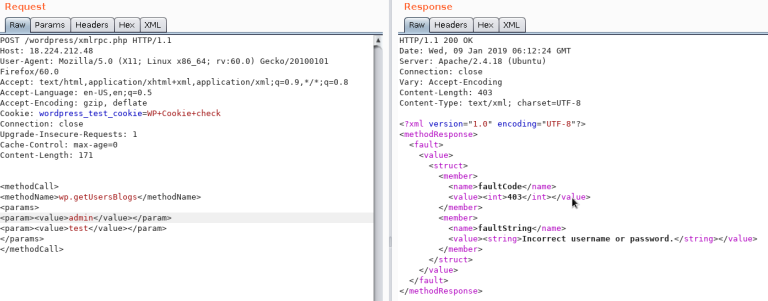
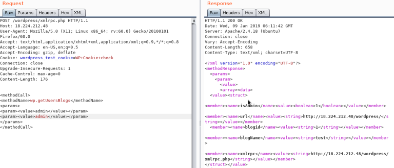

# Wordpress

Em aplicações que se utilizam de **Wordpress**, há algumas vulnerabilidades que podem ser testadas, como as seguintes que irão ser demonstradas abaixo.


**Permissões de Usuários:**&#x20;


Administrator;

Editor: Publica e administra os posts;

Author: Publica e administra os seus posts;

Contributor: Escreve e administra os posts, mas não pode enviar;

Subscriber: Pesquisa por posts e edita seu perfil;


**Enumeração de usuários:**


Wordpress possui alguns usuários padrão (como webmaster) e caso a aplicação não tenha sanitizado suficientemente, é possível enumerar os usuários presentes. Basta realizar o seguinte comando:

```
curl https://(alvo).com.br/wp-json/wp/v2/users
```

Assim irá retornar usuários presentes na plataforma, porém apenas informações como: id, name e slug.


**Páginas Padrão Presentes**


Wordpress possui algumas páginas como default e que caso não seja removidas ou modificadas, muita das vezes apresentam informações como versão da aplicação. As páginas padrão são:

_https://(alvo).com.br/license.txt_
\
_https://(alvo).com.br/readme.html_
\
_https://(alvo).com.br/wp-admin/login.php_
\
_https://(alvo).com.br/wp-admin/wp-login.php_
\
_https://(alvo).com.br/login.php_
\
_https://(alvo).com.br/wp-login.php_
\
_https://(alvo).com.br/xmlrpc.php_


**Versões desatualizadas de plugins (Wpscan)**


Wordpress utiliza-se de vários plugins que o usuário pode implementar para poder executar funções diferentes dentro da plataforma. Porém caso os mesmos não estejam atualizados podem expor a aplicação a riscos de exploits públicos que caso um agente de ameaça os identifique pode explorar e causar sérios riscos a aplicação.

Para identificar é utilizado uma ferramenta chamada Wpscan, que funciona identificando plugins e templates desatualizados e seus exploits.

A início é recomendado que você realize um cadastro na plataforma ([https://wpscan.com](https://wpscan.com/)) para poder resgatar seu token api, com o mesmo permite scans mais efetivos e aprofundados.


Por fim o comando que é utilizado para encontrar plugins desatualizados (de forma agressiva) é o seguinte:


```
wpscan --url https://(alvo).com.br --api-token (token) -e ap --plugins-detection 
aggressive 
```

Onde:

_--url_ = seu alvo

_--api-token_ = token api adquirido ao cadastrar-se na plataforma

_-e_ = enumerar

_ap_ = todos os plugins

_--plugins-detection aggressive_ = performar um scan mais agressivo no alvo


**XMLRPC**


Se o xmlrpc está ativo, você pode performar um ataque de força bruta nas credenciais ou usar isso para rodar um ataque DoS.

Para verificar se está ativo entre na url _/xmlrpc.php_ e coloque o seguinte payload na requisição:


```html
<methodCall>
<methodName>system.listMethods</methodName>
<params></params>
</methodCall>
```

Deve ficar dessa maneira:


<figure><figcaption><p>Figura: Requisição XMLRPC</p></figcaption></figure>


**Brute Force nas credenciais**


Para perfomar este ataque, _wp.getUserBlogs, wp.getCategories ou metaWeblog.getUsersBlogs_ são alguns métodos usados, você deve inserir:


```html
<methodCall>
<methodName>wp.getUsersBlogs</methodName>
<params>
<param><value>admin</value></param>
<param><value>pass</value></param>
</params>
</methodCall>
```


Dentro do valor "_param_" você insere as credenciais para testar, caso a resposta não seja "_Incorrect username or password_" dentro de um código 200, você conseguiu as credenciais corretas.


<figure><figcaption><p>Figura: Credencial incorreta</p></figcaption></figure>


<figure><figcaption><p>Figura: Credencial correta</p></figcaption></figure>


**Painel RCE**


Caso você consiga logar com as credenciais de administrator, você pode modificar um tema (404) para configurar uma shell, para isso vá para:

_Aparência ---> Editor de Temas ---> Template 404_


Dentro dele você pode modificar para inserir um payload php para abrir uma reverse shell.



