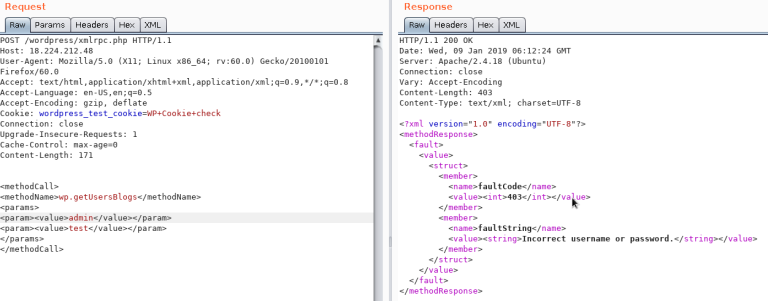
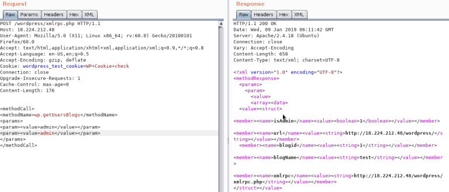

# Técnicas

Nesta seção você encontra:

* [Injeção de Modelo no Servidor](tecnicas.md#injecao-de-modelo-no-servidor)
* [Controle de Conta via Desvio de Limite de Taxa](tecnicas.md#controle-de-conta-via-desvio-de-limite-de-taxa)
* [Exposição Excessiva de Dados](tecnicas.md#exposicao-excessiva-de-dados)
* [Account Takeover](tecnicas.md#account-takeover)
* [Wordpress](tecnicas.md#wordpress)
* [Mattermost](tecnicas.md#mattermost)
* [Duplo Fator / MFA](tecnicas.md#duplo-fator-mfa)
* [Race Condition](tecnicas.md#race-condition)


## Injeção de Modelo no Servidor

**Detecção:** ` a `

**Depuração:** ``

**Divulgando Portal do Admin:** `` <mark style="color:green;">= /secret-admin-portal</mark>


**Divulgando Credenciais:**

<pre><code>  
{{e.user.get username}} : {{e.user.password}} 
</code></pre>


**Credenciais com hash do Django Descartadas**


**Descriptografado usando Hashcat:**&#x20;

`hashcat -m 10000 hashed_passwords rockyou. txt` <mark style="color:green;">= Django Admin Panel Pwn</mark>


***


## Controle de Conta via Desvio de Limite de Taxa

Em um programa privado de bug bounty, quando uma redefinição de senha era iniciada, os usuários eram obrigados a inserir um `código numérico de seis dígitos` enviado para seu e-mail para verificação.

Para evitar `ataques de força bruta`, o aplicativo implementou proteção de `limite de taxa`, restringir o número de solicitações que os usuários podem fazer dentro de um prazo específico. Se esse limite fosse superado, o sistema emitiu uma mensagem de erro `"429 Too Many Requests."`

No entanto, a proteção de limite de taxa foi contornada pela adição de dois cabeçalhos `X-Forwarded-For: IP.`


```
POST /reset HTTP/2
Host: example. com
X-Forwarded-For: 1.1.1.1
X-Forwarded-For: 2.2.2.2
```


Ao substituir o endereço IP no segundo cabeçalho `X-Forwarded-For`, tornou-se possível ignorar o `limite de taxa` e tentar vários códigos até que o correto seja encontrado.

A exploração desta vulnerabilidade permitiu o controle não autorizado de qualquer conta dentro do aplicativo.


***


## Exposição Excessiva de Dados

Em um programa privado de bug bounty, a resposta à solicitação de login tinha três parâmetros: `isAdmin`, `isStaff` e `isSupport`. Todos os três foram inicialmente definidos como `false`. Configurando eles para `true` concedeu acesso a um novo endpoint que permitiu pesquisar empresas usando seus IDs de registro.

Uma solicitação GET para o seguinte endpoint foi feita ao procurar uma empresa:


```
GET /company/companies.json?registration number=123456&page=1&per=1 HTTP/1.1
Host: api.site.com

```


A `GUI`exibia apenas o `nome da empresa`. No entanto, ao usar o Burp Suite para analisar a resposta, `informações pessoais confidenciais` da empresa foram expostas. O divulgado as informações incluíam `nome da empresa`, `e-mail`, `número de telefone` e `endereço completo (Rua, Cidade, País).`

Esses dados eram inicialmente exclusivos de uma única empresa e qualquer tentativa de força bruta não permitido nesse endpoint devido à presença de proteção de limite de taxa.

Limpei os valores de todos os parâmetros e enviei a solicitação com os campos vazios.


```
GET /company/companies.json?registration number=&page=&per= HTTP/1.1
Host: api.site.com
```


Como resultado, as informações confidenciais de todas as empresas do programa foram expostas. Era um Divulgação em massa de PII afetando mais de 40 mil empresas.


Quando você se depara com um `IDOR` que requer `UUID`, como:


```
DELETE /vl/api tokens/d90093bc-b2f7-11ed-afal-0242ac120002 HTTP/2
Host: api.site.com
Cookie:
```


Se você não conseguir encontrar o `UUID` em nenhum lugar, tente encontrar endpoints que divulguem o  `UUID` dentro da mesma organização.


```
GET /v1/api tokens/ HTTP/2
Host: api.site.com
Cookie:
```


Agora verifique se você pode acessar o mesmo endpoint usando uma conta de usuário com `privilégios mais baixos.` Se puder, você poderá explorar o `IDOR` usando uma conta de usuário com `privilégios mais baixos.`


***


## Account Takeover

A vulnerabilidade de **Account Takeover** se remete a quando um atacante consegue aproveitar de algum fluxo vulnerável para obter acesso a contas as quais o mesmo não poderia ter acesso.


É sempre interessante analisar os endpoints dos campos de Esqueci a senha, Criar conta, pois os mesmo podem ser vulneráveis a ataques de Account Takeover.


**Pontos para se atentar:**


Um ponto a se observar é qual o **endpoint** que faz a criação do novo usuário, com ele podemos comparar a outras funções dentro da aplicação como a de alterar informações de usuário, caso forem o mesmo endpoint, pode-se testar inserir dados válidos dentro da requisição para avaliar como a aplicação responde.

Verificar se existe **token** neste ponto, caso não haver um token, um atacante pode aproveitar para realizar as ações não autorizadas e por não haver a existência de um token suas ações serão aceitas pela aplicação.


Verificar o mecanismo de **Esqueci a senha**, em alguns casos pode ocorrer falhas lógicas resultando em account takeover, como por exemplo ao interceptar a requisição podemos adicionar mais um e-mail dentro do solicitado de esqueci a senha, o payload pode ser como a seguir:

```
{"email":["vitima@gmail.com","seuemail@gmail.com"]}
```

Em alguns casos, pode ocorrer de ambos os endereços receberem o e-mail de alteração de senha, o que pode ocorrer de um atacante alterar a senha do e-mail da vítima.


**XSS para Account Takeover** - em alguns casos em que a aplicação possua a vulnerabilidade de xss, pode utilizar o payload para capturar cookies dentro da aplicação, com os cookies capturados é possível logar como o usuário dos cookies que foram capturados.


***


## Wordpress

Em aplicações que se utilizam de **Wordpress**, há algumas vulnerabilidades que podem ser testadas, como as seguintes que irão ser demonstradas abaixo.


**Permissões de Usuários:**&#x20;


Administrator;

Editor: Publica e administra os posts;

Author: Publica e administra os seus posts;

Contributor: Escreve e administra os posts, mas não pode enviar;

Subscriber: Pesquisa por posts e edita seu perfil;


**Enumeração de usuários:**


Wordpress possui alguns usuários padrão (como webmaster) e caso a aplicação não tenha sanitizado suficientemente, é possível enumerar os usuários presentes. Basta realizar o seguinte comando:

```
curl https://(alvo).com.br/wp-json/wp/v2/users
```

Assim irá retornar usuários presentes na plataforma, porém apenas informações como: id, name e slug.


**Páginas Padrão Presentes**


Wordpress possui algumas páginas como default e que caso não seja removidas ou modificadas, muita das vezes apresentam informações como versão da aplicação. As páginas padrão são:

_https://(alvo).com.br/license.txt_
\
_https://(alvo).com.br/readme.html_
\
_https://(alvo).com.br/wp-admin/login.php_
\
_https://(alvo).com.br/wp-admin/wp-login.php_
\
_https://(alvo).com.br/login.php_
\
_https://(alvo).com.br/wp-login.php_
\
_https://(alvo).com.br/xmlrpc.php_


**Versões desatualizadas de plugins (Wpscan)**


Wordpress utiliza-se de vários plugins que o usuário pode implementar para poder executar funções diferentes dentro da plataforma. Porém caso os mesmos não estejam atualizados podem expor a aplicação a riscos de exploits públicos que caso um agente de ameaça os identifique pode explorar e causar sérios riscos a aplicação.

Para identificar é utilizado uma ferramenta chamada Wpscan, que funciona identificando plugins e templates desatualizados e seus exploits.

A início é recomendado que você realize um cadastro na plataforma ([https://wpscan.com](https://wpscan.com/)) para poder resgatar seu token api, com o mesmo permite scans mais efetivos e aprofundados.


Por fim o comando que é utilizado para encontrar plugins desatualizados (de forma agressiva) é o seguinte:


```
wpscan --url https://(alvo).com.br --api-token (token) -e ap --plugins-detection 
aggressive 
```

Onde:

_--url_ = seu alvo

_--api-token_ = token api adquirido ao cadastrar-se na plataforma

_-e_ = enumerar

_ap_ = todos os plugins

_--plugins-detection aggressive_ = performar um scan mais agressivo no alvo


**XMLRPC**


Se o xmlrpc está ativo, você pode performar um ataque de força bruta nas credenciais ou usar isso para rodar um ataque DoS.

Para verificar se está ativo entre na url _/xmlrpc.php_ e coloque o seguinte payload na requisição:


```html
<methodCall>
<methodName>system.listMethods</methodName>
<params></params>
</methodCall>
```

Deve ficar dessa maneira:


<figure><figcaption><p>Figura: Requisição XMLRPC</p></figcaption></figure>


**Brute Force nas credenciais**


Para perfomar este ataque, _wp.getUserBlogs, wp.getCategories ou metaWeblog.getUsersBlogs_ são alguns métodos usados, você deve inserir:


```html
<methodCall>
<methodName>wp.getUsersBlogs</methodName>
<params>
<param><value>admin</value></param>
<param><value>pass</value></param>
</params>
</methodCall>
```


Dentro do valor "_param_" você insere as credenciais para testar, caso a resposta não seja "_Incorrect username or password_" dentro de um código 200, você conseguiu as credenciais corretas.


<figure><figcaption><p>Figura: Credencial incorreta</p></figcaption></figure>


<figure><figcaption><p>Figura: Credencial correta</p></figcaption></figure>


**Painel RCE**


Caso você consiga logar com as credenciais de administrator, você pode modificar um tema (404) para configurar uma shell, para isso vá para:

_Aparência ---> Editor de Temas ---> Template 404_


Dentro dele você pode modificar para inserir um payload php para abrir uma reverse shell.


***


## Mattermost

Mattermost é uma aplicação open source de bate-papo muito utilizada por organizações e empresas, ela se torna uma alternativa entre o Microsoft Teams e o Slack.


Em um pentest realizado, foi encontrado algumas vulnerabilidades na empresa que utilizava-se esta aplicação desatualizada.

Quando acessado o link de acesso ao bate-papo, de imediato não temos acesso ao grupos pois apenas quem é invitado pode participar e visualizar o conjunto,

Entretanto, quando interceptamos essa requisição com o Burp Suite, podemos visualizar que usualmente a requisição se faz por:

```
GET /api/v4/users/me/groups
```

Quando enviado ao repeater, podemos trocar essa requisição para:

```
GET /api/v4/users
```

Assim, conseguimos listar todos os usuários que utilizam o Mattermost, exibindo seus IDs, nome completo, nickname, email, data de criação da conta, cargo, entre outras informações, tornando assim possível um atacante enumerar todos os usuários e utilizar um ataque de força bruta para tentar acessar a conta do usuário.


Sendo assim, devemos sempre manter nossas dependências atualizadas para evitar de que vulnerabilidades presentes em versões anteriores afetem a operação da empresa.


***


## Duplo Fator / MFA

**Verifique se o código enviado para seu e-mail/sms é devidamente atrelado a conta do usuário:**&#x20;

Tente fazer login na conta X usando o código da conta Y.


**Caso em que a aplicação te redireciona para uma página de formulário para que o código de verificação seja preenchido e em seguida te direciona para outra parte da aplicação:**&#x20;

Verifique se o cookie de usuário está sendo settado no momento em que você preenche as credenciais de usuário, isso pode causar com que o atacante pule a etapa de preencher o código 2AF direto para dentro da aplicação.


**Atente-se aos tokens atribuídos a função de "Esqueci minha senha" ou semelhante:**&#x20;

Verifique se o token está sendo devidamente validado alterando o nome/e-mail de usuário e veja como a aplicação se comporta. Você também pode tentar remover o token da solicitação e ver se ele de fato está sendo verificado.


**Cheque quais cookies estão sendo settados no momento em que preenche as credenciais:**&#x20;

Caso exista algum cookie com nome de usuário, indicando que aquele usuário está no processo de 2AF, você pode tentar alterar o valor desse cookie para um valor arbitrário/outra conta e ver como a aplicação se comporta.


**Tente usar o link de verificação recebido no e-mail quando sua conta foi criada:**&#x20;

Você pode tentar reutilizar o link de verificação que foi lhe enviado no e-mail quando sua conta foi criada para verificar se você consegue acessar sua conta sem a necessidade do 2AF.


**Muitas vezes, ao utilizar o link de redefinir senha, após cadastrar uma nova, você é redirecionado diretamente para dentro da sua conta:**&#x20;

Verifique se você consegue usar esse link múltiplas vezes, caso esse comportamento esteja presente, você consiga reutilizar o link e o código atrelado ao link seja previsível, significa que você pode simplesmente roubar outras contas.


**Ainda sobre a função de redefinir senha:**&#x20;

Habilite o 2AF em sua conta, deslogue e utilize a função de redefinir sua senha. Após isso verifique se o 2AF ainda está habilitado, caso contrário, você já sabe.


**Sem rate-limit na tentativa de inserir o código de 2AF:**&#x20;

Nesses casos, tente realizar um brute-force no formulário responsável pelo preenchimento do código que é enviado via e-mail/sms.


**Códigos de backup:**&#x20;

Verifique se é possível realizar brute-force nessa função;&#x20;

Tente os gerar novamente;&#x20;

Verifique se o CORS da página que informa os códigos de backup está devidamente configurado.


***


## Race Condition

O principal problema de explorar Race Conditions é que você precisa que as solicitações sejam processadas em paralelo com uma diferença de tempo muito curta (geralmente >1ms). A versão 2023.9 do Burp Suite introduz uma nova função no Burp Repeater, focada em aprimorar a capacidade de enviar solicitações em paralelo com um impacto reduzido do jitter de rede. Onde o jitter de rede pode afetar negativamente a sincronização de solicitações.

\
O HTTP2 permite enviar 2 solicitações em uma única conexão TCP, enquanto em HTTP/1.1 elas precisam ser sequenciais. Então, o uso de um único pacote TCP elimina completamente completamente o efeito do jitter.

\
A base da exploração de um Race Condition consiste em múltiplos threads interagindo com o mesmo dado ao mesmo tempo, resultando em um tipo de "colisão" que causa um comportamento inesperado. O tipo mais conhecido de Race Condition é exceder algum tipo de limite imposto pela lógica da aplicação.

\
Hoje em dia a aplicação raramente é elaborada tendo em mente os riscos de simultaneidade e como resultado, Race Conditions acaba sendo uma vulnerabilidade presente na maioria dos sistemas.

\
Os exploits na maioria das vezes se baseiam na ultrapassagem de limite, por exemplo:

* Utilização de gift cards múltiplas vezes
* Aplicação de cupons múltiplas vezes
* Convidar a mesma pessoa múltiplas vezes
  * Verifique como a aplicação se comporta
  * Caso funcione, exclua um usuário
  * Verifique se o usuário persiste no projeto
* Ultrapassar o limite imposto por um determinado plano de usuário (e.g. plano Básico x Pro)

\
A causa de todos eles é semelhante. Todos exploram o intervalo de tempo entre a verificação de segurança e a ação. Por exemplo, dois threads podem consultar simultaneamente um banco de dados e confirmar que o código de desconto LESIS10 não foi aplicado ao carrinho, então ambos tentam aplicar o desconto, resultando na aplicação do mesmo duas vezes.

\
Com isso, você pode optar por testar qualquer função na aplicação que você ache passivo de sofrer de um Race Condition e que tenha um impacto significativo.

\
Caso tenha dúvidas em relação ao envio de múltiplas requisições com o Burp Repeater, leia: [Sending grouped HTTP requests](https://portswigger.net/burp/documentation/desktop/tools/repeater/send-group#sending-requests-in-parallel)

\
Caso ainda tenha duvidas de como a exploração funciona, teste os laboratórios da PortSwigger abordando o assunto e leia o writeup do desafio web do Hack The Box "Diogenes Rage":

* [drt.sh - HTB Diogenes Rage Writeup](https://drt.sh/posts/htb-diogenes-rage/)
* [PortSwigger Labs - Race Conditions](https://portswigger.net/web-security/all-labs#race-conditions)

\
Referências

* [PortSwigger - Race Conditions](https://portswigger.net/web-security/race-conditions)
* [PortSwigger Research - Smashing the state machine](https://portswigger.net/research/smashing-the-state-machine)
* [PortSwigger Research - Cracking reCAPTCHA, Turbo Intruder style](https://portswigger.net/research/cracking-recaptcha-turbo-intruder-style)

***


[^1]: 
