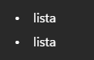
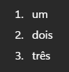
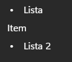
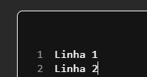

# Markdown

**Markdown** é basicamente uma maneira de fazer marcações no texto (negrito, sublinhado...) através de comandos.


**Marcações de Texto**

```
*itálico*
**negrito**
~~riscado~~
```


**Como fica:**

<figure><figcaption></figcaption></figure>


**Listas**

```
*lista
-lista
```


**Como fica:**

<figure><figcaption></figcaption></figure>


**Listas Enumeradas**

```
1. um
2. dois
3. três
```


**Como fica:**

<figure><figcaption></figcaption></figure>


**Um Item dentro de uma Lista**

```
*Lista
Item
*Lista 2
```


**Como fica:**

<figure><figcaption></figcaption></figure>


**Links**

```
Isto é um [link] (https://google.com)
```


**Como fica:**

<figure><figcaption></figcaption></figure>


**Código**

```
O texto tem um simples `codígo`
```


**Tabela**

````
```
Linha 1 
Linha 2
```
````


**Como fica:**

<figure><figcaption></figcaption></figure>


**Menções**

```
@usuário
```
