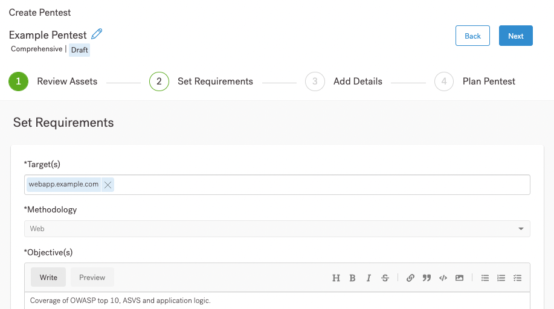

# Definir os Requisitos do Pentest

Depois de revisar seu ativo, você pode definir os requisitos de pentest.

<figure><figcaption></figcaption></figure>

**Nesta página da interface do usuário, você pode:**

* Especifique um alvo de Pentest.
* Defina uma metodologia de Pentest, com objetivos detalhados. Você pode ler sobre os objetivos associados a cada tipo de ativo.
* Inclua credenciais de teste.
* Adicione instruções especiais.
* Defina a tecnologia Stack.

Se você não tem certeza do que incluir na interface do usuário, siga os links associados a cada item. Se você tem experiência em definir pentests, preencha a página e continue para os **Requisitos Detalhados do Teste do Pentest.**

Utilizamos as metodologias de Pentest listadas na página. Se você deseja saber mais sobre cada metodologia, navegue até a página associada ao seu ativo.

Se você começar no topo da página de requisitos de pentest, seu próximo passo é especificar um **alvo**.

**Pentest Alvo**

Indique onde nossos pentester podem encontrar seu ativo

**Teste as Credenciais**

Nossos pentesters precisam de contas dedicadas para testar seus sistemas.

**Instruções Especiais**

Cada ativo é único. O que nossos pentester precisam saber sobre ele?

**Tecnologia Stack**

Nossos pentesters precisam saber as tecnologias por trás do seu ativo.

