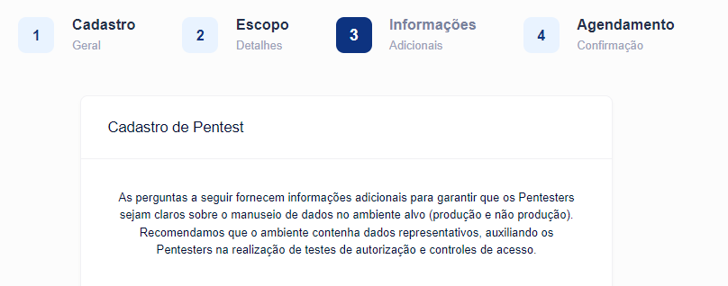

# Especifique os Detalhes do Pentest

Alguns requisitos detalhados variam de acordo com o tipo de ativo.

Agora que você definiu os principais requisitos para o seu pentest, adicione mais detalhes. Nossos pentests têm requisitos comuns para todos os ativos, bem como requisitos específicos para ativos específicos.

Os requisitos de Pentest para ativos Web e API são idênticos. No entanto, os testes de um ativo Web incluem testes das APIs usadas para preencher o conteúdo desse ativo.

<figure><figcaption></figcaption></figure>

A página **Adicionar Detalhes** do assistente de pentest solicita informações sobre:

* O ambiente alvo
* Provedores de nuvem, caso eles precisem de sua autorização

**Requisitos comuns de Pentest**

Nossos pentests possuem as características listadas nesta seção:

**Informações de Rede**

Nossos pentesters enviam solicitações de um ou mais endereços IP em uma Rede Privada Virtual. Compartilhe este pentest com o administrador de rede. Eles podem precisar saber os endereços IP que utilizamos:

Lista de Endereços IP:

**Ambiente:**

Precisamos conhecer o ambiente do ativo de teste de invasão. As opções padrão são:

* Produção (para usuários finais)
* Staging (ambiente de produção proposto para o futuro)
* Desenvolvimento (recurso em trabalho)

Se você definir seu ambiente de forma diferente, nos avise. Adicione essa informação nos comentários.

<figure><figcaption></figcaption></figure>

**Controles**

Conte-nos sobre como você regulou o acesso aos seus sistemas. Por exemplo, os administradores podem configurar regras de firewall que limitam o acesso ao tráfego especificado para reduzir o risco de ataques de negação de serviço.

Você pode usar sistemas como:

* Firewalls de Aplicação Web (WAF)
* Restrições baseadas em IP usando listas de permissão/negação, ou serviços como iptables.

<figure><figcaption></figcaption></figure>

Se você tiver controles de taxa, inclua detalhes. Por exemplo, você pode incluir detalhes como:

* Limite as mensagens de ping (ICMP) para 2 por segundo.

**Componentes Plataforma Cloud**

Se parte do seu ativo está armazenado na nuvem, você pode não precisar de um teste de ativo em nuvem separado. Conforme descrito nesta pergunta, se o seu ativo inclui "sistemas" instalados em uma nuvem, você pode incluir a plataforma e o nome do sistema na caixa de texto.

Em alguns casos, você pode precisar informar seu provedor de nuvem sobre testes. Para orientação, consulte nossa página sobre Metodologias em Nuvem.

**Diretrizes adicionais**

Você pode ter respondido a essas perguntas ao configurar as Instruções Especiais ao definir os requisitos de pentest. Fique à vontade para adicionar mais informações aqui.

**Testar Dados**

Nossos pentesters precisam saber sobre o ambiente que estão testando, bem como se podem encontrar dados de produção no sistema de teste.

Nossos pentesters também precisam de informações sobre os dados de teste. Se seus aplicativos contiverem:

* Informações de Identificação Pessoal (PII)
* Informações de Saúde Protegidas (PHI)
* Dados do titular do cartão de crédito (CHD)

Nossos pentesters tomam cuidado extra para proteger essas informações.

Alguns aplicativos suportam o uso de cartões de crédito para compras. Se você fornecer números de cartão de crédito de teste, você pode compartilhar essas informações nas instruções ou na "chamada de início".

> Nota:
>
> Todos os pentesters da Vantico assinaram um Acordo de Confidencialidade (NDA).

Agora que você preencheu os detalhes, você pode começar a planejar e delimitar o pentest atual.
