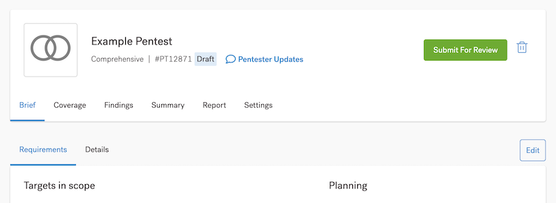
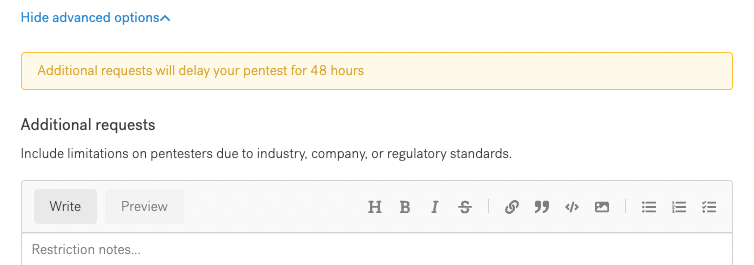

# Revisar e Enviar o Pentest

Tenha certeza que nossos pentester tem a informação de que precisam

Nas seções anteriores, você salvou o que inseriu para o pentest. Agora você pode revisar seu trabalho. Antes de selecionar **Enviar para Revisão**, siga esta lista de verificação para **Requisitos e Detalhes.**

<figure><figcaption></figcaption></figure>

Para ambas as abas, você pode selecionar **Editar** para fazer alterações.

**Requisitos**

Abaixo da aba de Requisitos, você pode revisar:

* Tipo do Pentest
* Alvos
* Metodologia do Pentest, para **ativos combinados**
* Objetivos, que definem as metodologias que nossos pentesters utilizam como uma lista de verificação
* Testar Credenciais
* Instruções para Pentesters
* Tecnologia Stack por trás do seu Ativo
* Periodo de Teste, Parâmetros do Escopo e créditos requiridos

**Pedidos Adicionais**

Você pode especificar requisitos especiais para pentesters. Por exemplo, se a indústria, empresa ou regulamentações nacionais exigirem que você limite os pentesters a residentes de um ou mais países, você pode solicitar isso.

Role até o final da guia **Requisitos**, selecione **Mostrar opções avançadas** e adicione suas observações em **Solicitações adicionais.**

<figure><figcaption></figcaption></figure>

**Detalhes**

Abaixo da aba **Detalhes**, você pode revisar:

* O ambiente do alvo para seu ativo
* Controles de limitação de taxa
* Componentes da plataforma Cloud
* Diretrizes adicionais
* Sensibilidade dos dados de teste

**Quando você estiver pronto**

Se você estiver pronto com seu pentest, selecione Enviar para Revisão.

Uma vez que feito isso, aprenda o que esperar depois de criar um pentest.
