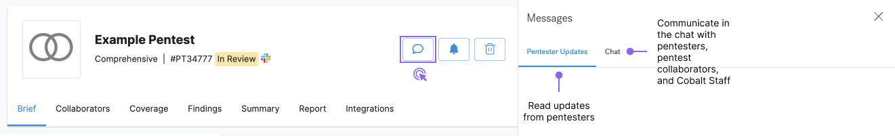
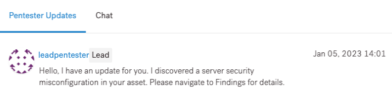
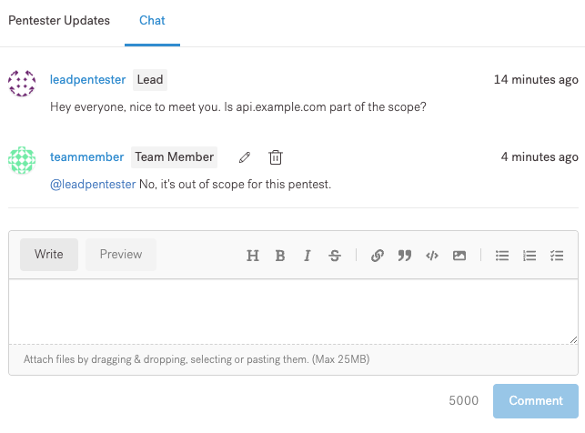

# Colabore em Pentests


Colabore com pentesters, seus colegas de equipe e a equipe da Vantico durante todo o pentest.


**Você pode usar os seguintes canais de comunicação:**

* Mensagens no aplicativo Vantico
* Um canal do Slack dedicado ao seu pentest
* Barra lateral de atualizações do Pentester no aplicativo Vantico

À medida que nossos pentesters testam seu ativo, eles atualizam você sobre o progresso em tempo real. Aqui está o que esperar:

* Os pentesters relatam vulnerabilidades que descobrem em seu software.
* Você pode receber perguntas de nossos pentesters.
* Você pode enviar comentários para pentesters e seus colegas de equipe.
* Os membros da equipe da Vantico podem entrar em contato para pedir ajuda.

**Colabore no aplicativo Vantico**


Para ativar esse recurso, entre em contato com seu Gerente de Sucesso do Cliente (CSM) ou [support@vantico.com.br](mailto:support@vantico.com.br).


Comunique-se com pentesters e colaboradores de pentest na plataforma Vantico, sem usar ferramentas de terceiros.

Navegue até Pentests, selecione um pentest e selecione o ícone de bate-papo

<figure><figcaption></figcaption></figure>

Na barra lateral que é aberta, você pode ver duas guias:

* **Atualizações do Pentester**: Leia as atualizações dos nossos pentesters enquanto eles testam seu ativo. Nesta aba, você só pode visualizar o que os pentesters postaram. Para iniciar uma conversa, vá para a guia Bate-papo.

<figure><figcaption></figcaption></figure>

* **Bate-papo**: comunique-se com pentesters, colaboradores de pentest e equipe da Vantico em tempo real.
  * Para enviar uma mensagem, insira-a no campo de entrada e selecione Comentário.
  * Para mencionar um usuário em sua mensagem, digite @ e selecione um usuário.
  * Os usuários recebem notificações por e-mail para cada menção.
  * Você pode adicionar emoji às suas mensagens.
  * Você pode editar ou excluir seus comentários depois de postados.

<figure><figcaption></figcaption></figure>

Como nossos pentesters compartilham vulnerabilidades encontradas em tempo real, você pode começar a corrigir as descobertas antes que o pentest seja concluído. Revise e analise cada descoberta. Você pode:

* Corrija a descoberta e envie-a para  re-test
* Marque a descoberta como Risco Aceito

