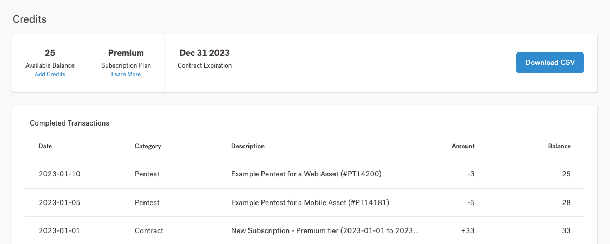

# Créditos Vantico


Um crédito Vantico é uma unidade de trabalho padronizada que representa 1 horas de pentesting.


**Como funcionam os créditos Vantico**

Você pode pensar em um crédito Vantico como um voucher virtual que você consome sempre que deseja realizar um pentest. Oferecemos três planos de assinatura, também conhecidos como níveis PtaaS, para melhor atender ao seu orçamento e objetivos de teste. Saiba mais sobre nosso modelo de preços.

> 1 crédito = 1 horas de pentest.

A Vantico oferece um modelo de consumo flexível e sob demanda para atender às necessidades modernas de pentesting de todas as equipes de segurança e desenvolvimento. Vendemos créditos em pacotes anuais. Você pode comprar créditos antecipadamente e usá-los ao longo do ano com base em sua programação de pentesting.

O número de créditos necessários para um pentest depende do escopo do pentest. Para obter mais informações, consulte Planejar e definir o escopo do Pentest.

**Visualize e acompanhe seus créditos**

Como proprietário ou membro da organização, você pode visualizar e rastrear os créditos da sua organização. Navegue até a página **Créditos** para ver o saldo atual e analisar como sua organização usa os créditos.

<figure><figcaption></figcaption></figure>

**Compre mais créditos**

Para comprar mais créditos para sua organização, siga um destes procedimentos:

* Entre em contato com seu Gerente de Sucesso do Cliente (CSM) ou support@vantico.com.br
* No aplicativo Vantico, selecione **Adicionar Créditos** e confirme sua ação na sobreposição. Você também pode fazer uma solicitação na página **Créditos**.

<figure><figcaption></figcaption></figure>

Depois de comprar créditos, eles aparecerão na página Créditos na data de início da sua assinatura. Os créditos não estão disponíveis antes dessa data. Se precisar deles mais cedo, entre em contato com seu CSM.

**Acompanhe seus créditos**

Visualize e acompanhe seus créditos no painel.

**Níveis PtaaS Vantico**

Saiba mais sobre nossos pacotes de preços, também conhecidos como _níveis PtaaS._
