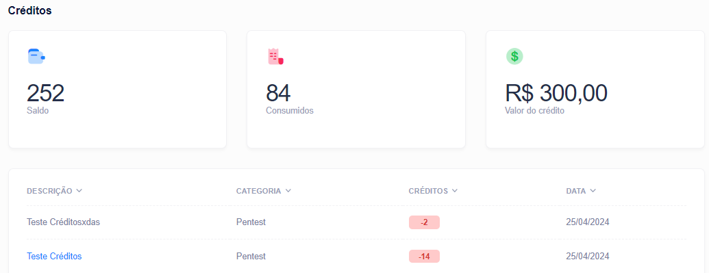

# Acompanhe seus Créditos


Navegue até a página **Créditos** para analisar como sua organização usa os créditos Vantico.


Aqui, os proprietários e membros da organização podem ver o seguinte:

* Saldo credor atual.
* Data de término do contrato mostrando quando seus créditos expiram.
* Histórico de transações de crédito pendentes e concluídas.
  * Você também pode ver seu nível PtaaS mostrado como **Plano de Assinatura.**

<figure><figcaption></figcaption></figure>

Sempre que o saldo credor muda, o histórico de transações é atualizado com os seguintes detalhes:

* Data da transação
* Categoria: Contrato ou Pentest
* Descrição:
  * Contrato: Mostra alterações de crédito relacionadas à sua assinatura.
  * Pentest: Exibe o título e ID do pentest para o qual os créditos foram usados.
* Valor da transação mostrando o número de créditos adicionados ou subtraídos
* Número de créditos restantes no saldo da conta após a conclusão da transação

Para baixar o histórico de transações concluídas em formato CSV, selecione **Baixar CSV**. Você pode importar o arquivo para o software de planilha de sua preferência.
