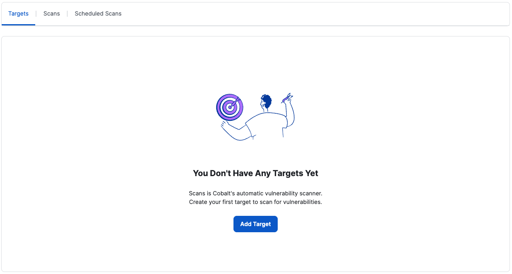
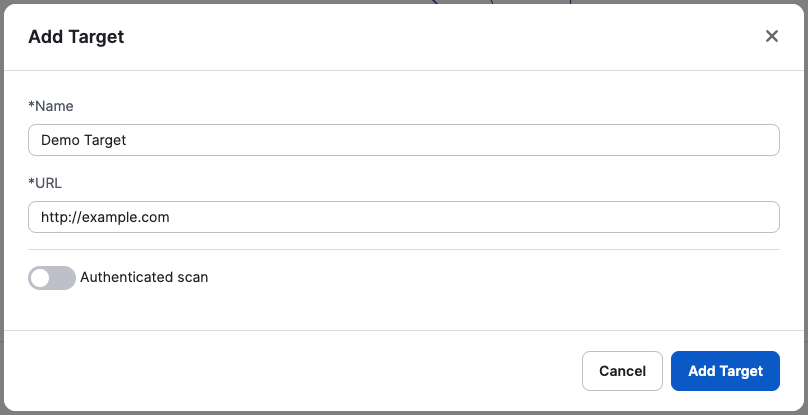
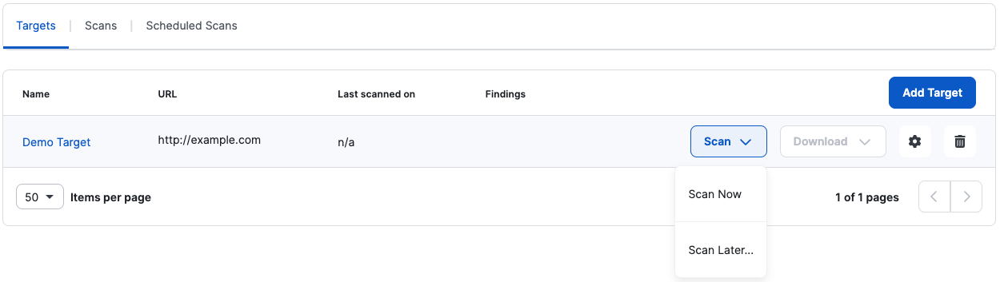
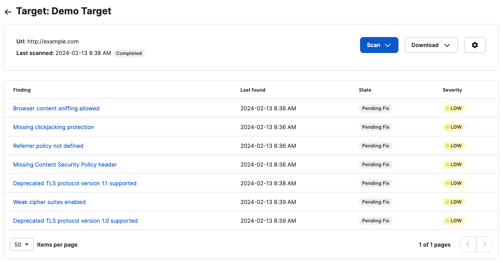
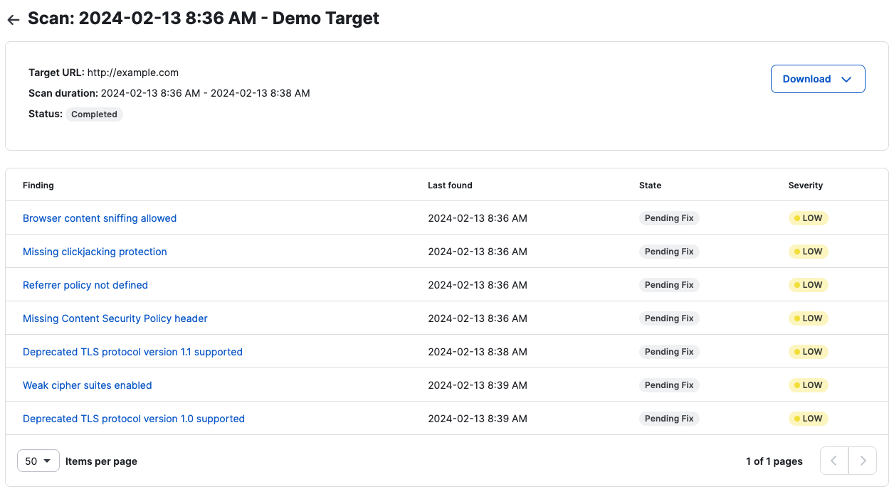
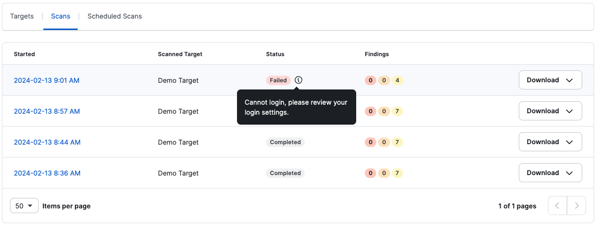
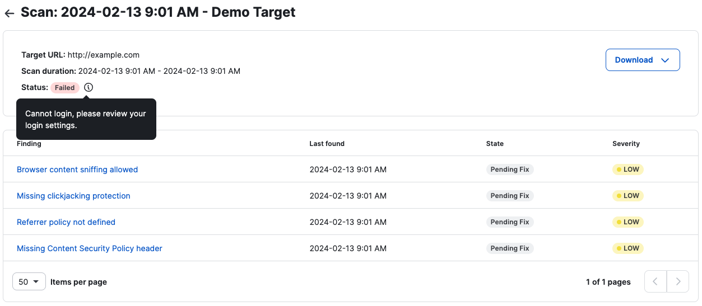
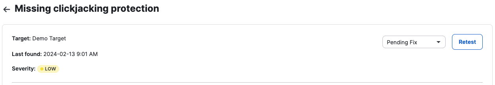
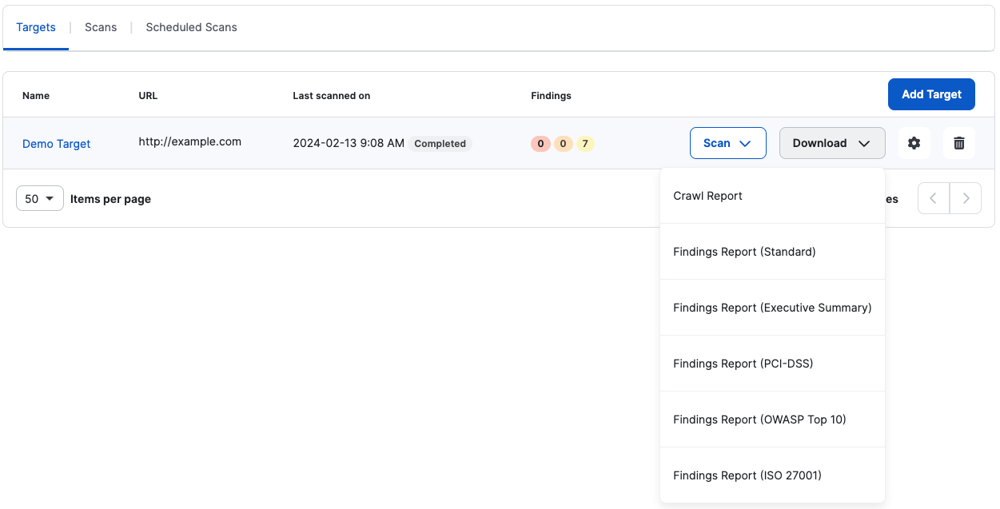

# DAST Scanner


Faça uma varredura em seus aplicativos da Web para descobrir vulnerabilidades externas.


A complexidade das aplicações atuais, aliada à constante evolução das ameaças cibernéticas, torna cada vez mais difícil garantir medidas de segurança. Os métodos tradicionais de avaliação de segurança muitas vezes não conseguem fornecer insights contínuos, levando a possíveis pontos cegos.

O DAST Scanner aborda esses desafios de frente. Ao combinar o poder do PtaaS com o DAST, você obtém uma solução abrangente para avaliação contínua de riscos.

Para começar a usar o DAST Scanner, você precisará adicionar um alvo. Cada cliente Vantico tem acesso a um alvo para digitalização gratuita e ilimitada. Alvos adicionais podem ser adquiridos. Saiba mais sobre metas.

> Nota:
>
> Usamos o seguinte endereço IP para fazer solicitações ao seu alvo: 52.19.40.38

**Como usar o DAST Scanner**

Adicione um alvo

* Para adicionar um alvo, selecione o botão Adicionar alvo

<figure><figcaption></figcaption></figure>

* Adicione um nome para o destino e o URL

<figure><figcaption></figcaption></figure>

* Veja mais sobre como configurar um alvo na **configuração de um alvo.**

**Agendamento de verificação**

* Para executar uma verificação, selecione “Iniciar verificação”
  * Você também pode agendar uma verificação posteriormente

<figure><figcaption></figcaption></figure>

**Resultados da verificação**

* Assim que a verificação for concluída, você terá duas opções para visualizar os resultados
  * Você pode ver os resultados no alvo

<figure><figcaption></figcaption></figure>

* Ou navegue até as verificações e visualize os resultados de verificações individuais clicando na Data de início.

<figure><figcaption></figcaption></figure>

**Falha nas verificações**

* Se a verificação falhar, navegue até a lista de verificações ou a página de detalhes da verificação para ver o motivo da(s) falha(s) na(s) verificação(ões).
  * Visualização da lista de verificação:

<figure><figcaption></figcaption></figure>

* Visualização de detalhes da verificação:

<figure><figcaption></figcaption></figure>

**Encontrando Estados**

* Mover estado de descoberta
  * Você pode atualizar o estado de cada descoberta
  * Cada descoberta tem os seguintes estados:
    * **Correção pendente (padrão)**: uma vulnerabilidade foi encontrada em uma verificação e não foi corrigida
    * **Recusado**: Este é um falso positivo e não é relevante para sua aplicação (cada um deles é revisado internamente pela Vantico)
    * **Risco Aceito**: Esta é uma vulnerabilidade conhecida, mas devido a um controle atenuante, o usuário aceita o risco.
    * **Testar novamente**: o usuário corrigiu a vulnerabilidade e está pronto para testar novamente a descoberta. Enviar um novo teste é a única maneira de marcar uma vulnerabilidade como “corrigida”.
* Retestar descoberta
  * Você pode testar novamente as descobertas individuais.
  * Navegue até a descoberta que deseja testar novamente e selecione “retestar”

<figure><figcaption></figcaption></figure>

* Se o mecanismo de verificação não encontrar a vulnerabilidade novamente, ele marcará automaticamente a descoberta como “Corrigida”. Se o problema persistir, ele voltará ao estado anterior.

**Relatórios**

Para conformidade e para entender melhor os resultados de suas verificações, oferecemos diferentes tipos de verificações.

Em Targets, clique em Download para selecionar o relatório que deseja baixar:

<figure><figcaption></figcaption></figure>

Você também pode fazer isso na lista de verificações ou na página de detalhes da verificação.

**Tipos de relatório**

Existem diferentes tipos de relatórios que você pode baixar de uma verificação. Observe que, para verificações com falha, os relatórios não estão disponíveis. A maioria desses relatórios são relatórios em PDF, exceto o relatório de rastreamento, que é um arquivo CSV.

**Relatório padrão**

É o tipo de relatório padrão e contém:

* Um resumo da verificação
* Um resumo das configurações
* Um resumo técnico
* Uma lista de testes exaustiva
* Todas as descobertas
* Informações sobre vulnerabilidades (impacto, causas e métodos de prevenção).

**Relatório Executivo**

É um relatório de visualização de alto nível da verificação e contém apenas:

* Um resumo da verificação
* Um resumo das configurações
* Um resumo técnico

**PCI-DSS**

É um relatório de varredura específico para conformidade com PCI-DSS. Você pode usar esse relatório para verificar quais controles um destino está passando ou falhando. O PCI-DSS é como o relatório padrão, mas adiciona uma seção ao resumo da verificação com a lista de verificação de requisitos do PCI-DSS.

O relatório indica se um alvo foi testado para a lista de verificação de requisitos e se passou em cada item da lista.

**Top 10 da OWASP**

É semelhante ao relatório PCI-DSS, mas considera o OWASP Top 10 mais recente. O relatório de varredura OWASP Top 10 usa uma estrutura popular fornecida pelo OWASP que lista os 10 principais riscos de segurança de aplicativos da web. Os auditores costumam usar essa estrutura ao realizar auditorias de segurança de uma empresa.

**ISO 27001**

É um relatório de verificação específico sobre conformidade com a ISO/IEC 27001 (revisão 2022). Você pode usar esse relatório para verificar quais controles um destino está passando ou falhando. A ISO 27001 é como o relatório padrão, mas adiciona uma seção ao resumo da varredura com a lista de verificação de requisitos da ISO 27001.

O relatório indica se um alvo foi testado para a lista de verificação de requisitos e se passou em cada item da lista.

**Relatório de rastreamento**

O relatório de rastreamento ou cobertura lista URLs que foram verificados junto com aqueles que não foram verificados. Isso funciona como uma ferramenta para você verificar se o scanner está alcançando todos os endpoints possíveis e filtrando-os com sucesso. Este relatório é um arquivo CSV, que você pode exportar para Excel ou qualquer ferramenta semelhante que você use.

Antes e durante os testes, o rastreador navegará em seu site para encontrar todos os endpoints possíveis enquanto testa todas as entradas que encontrar. Em seguida, esses URLs são enviados ao scanner para serem testados em busca de quaisquer vulnerabilidades.

A cobertura é um aspecto fundamental de uma varredura, pois pode ser a diferença entre uma varredura útil e bem-sucedida e uma varredura não informativa.

**Como entrar em contato com o suporte**

Para suporte, entre em contato com seu CSM ou envie um email para support@vantico.com.br

**Alvos**

Um destino é o URL de um aplicativo Web, site ou API.

**Autenticação de Alvo**

Mais informações sobre campos de autenticação de destino e hacks
