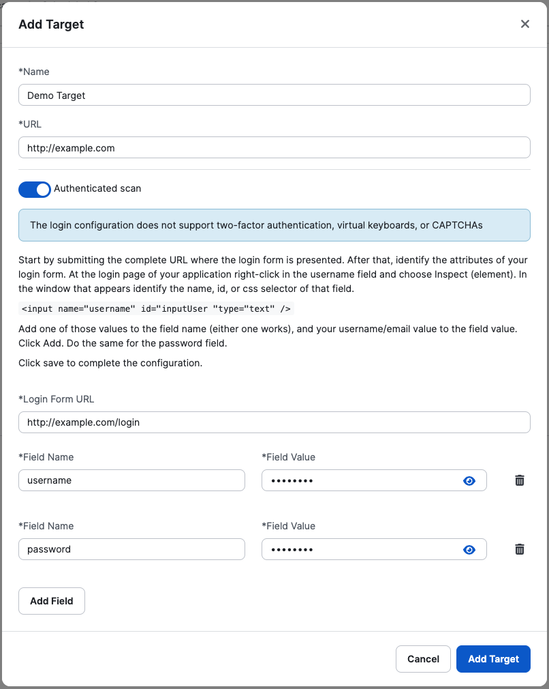

# Autenticação do Alvo

Se o seu site tiver áreas que exigem autenticação, você poderá fornecer credenciais ao DAST Scanner para fazer login no seu site. Ao fazer isso, você permite que o DAST Scanner execute uma verificação que pode revelar quaisquer vulnerabilidades em partes mais profundas do seu aplicativo.

**É recomendável que você crie um usuário para os testes, pois o DAST Scanner enviará formulários e clicará em botões, o que pode “poluir” a conta.**

Quando uma varredura é iniciada e o destino tem uma configuração de login, a primeira coisa que o rastreador faz é efetuar login no aplicativo (destino da web) para obter uma sessão. Após o login bem-sucedido, ele começará a rastrear o aplicativo. Enquanto o rastreador está em execução, ele verifica constantemente se a sessão ainda é válida. Atualmente essa verificação é realizada automaticamente com base na configuração do login, mas em breve teremos a opção de configurar como a perda de sessão poderá ser detectada.


**Etapas básicas**

Para adicionar autenticação, ative a opção “Verificação autenticada” e então:

1. Adicione o URL onde o formulário de login está localizado.
2. Adicione os campos necessários para login. Você provavelmente terá um campo para nome de usuário e outro para senha.

* Nome do campo
* Valor do campo

<figure><figcaption></figcaption></figure>


**Usando um formulário de login**

(aplicável quando o formulário de login requer um nome de usuário/e-mail e senha, o que é um caso de uso comum)

Para simplificar a configuração, exigimos a URL de Login e pelo menos um nome de campo com seu respectivo valor.


**O URL de login**

* O URL de login pode ser igual ao URL de destino se o formulário estiver localizado no caminho raiz ou se redirecionar automaticamente para a página de login.
* Se o caminho raiz não contiver o formulário de login ou não redirecionar para a página de login, uma URL específica deverá ser fornecida.
* Se o processo de login envolver um serviço de terceiros (como Auth0), use a URL que redireciona para o provedor de autenticação.

Por exemplo:

* Se _https://example.com/_ exibir o formulário de login, defina _https://example.com/_ como o URL de login.
* Se _https://example.com/_ redirecionar para https://example.com/login, defina _https://example.com/_ ou _https://example.com/login_ como o URL de login.
* Se _https://example.com/_ ou _https://example.com/login_ redirecionar para um provedor de autenticação de terceiros (por exemplo, _https://example.auth0.com/?token=xyz_), defina _https:/ /example.com/_ ou _https://example.com/login_ como URL de login.


**Os campos**

Exigimos os nomes e valores dos campos. Refere-se ao valor do nome do atributo de entrada HTML e ao valor que deve ser inserido na entrada. Por exemplo, para , o nome do campo deve ser nome de usuário e você deve fornecer o respectivo valor.

Agora é muito comum encontrar entradas sem o atributo name; no entanto, também oferecemos suporte ao uso do atributo id ou de um seletor CSS. Por exemplo,  - o nome do campo pode ser username\_id ou #username\_id.

Às vezes, só é possível usar seletores CSS. Por exemplo, o aplicativo usa consultas de mídia e há vários formulários com os mesmos nomes e IDs de entrada:

```
<form name="mobile_login_form" action="/mobile_login_action">
  <p>Username: <input type="text" name="username"></p>
  <p>Password: <input type="password" name="password"></p>
</form>
<form name="login_form" action="/login_action">
  <p>Username: <input type="text" name="username"></p>
  <p>Password: <input type="password" name="password"></p>
</form>
```


Neste caso, use o seletor CSS form\[name="login\_form"] input\[name="username"].

O botão para enviar o formulário de login geralmente é detectado automaticamente. No entanto, às vezes não está claro qual deles deve ser clicado por motivos como:

*   O formulário de login não está dentro de uma tag

    (um cenário comum hoje em dia).
* Há mais de um botão de envio dentro do formulário.

Para resolver isso, oferecemos a opção de definir o botão que deve ser clicado adicionando à configuração de login:

* Nome do campo: submit\_button
* Valor do campo: \<seletor CSS do botão> (deve ser um seletor CSS)


**Hacks extras para ajudar em determinadas situações**

Verifique se há perda de sessão:

* Nome do campo: check\_loggedout
* Valor do campo: \<seletor CSS de um elemento visível apenas quando desconectado> (por exemplo, form.login #username) ou
* Valor do campo: \["Seletor CSS 1", "Seletor CSS 2"] (por exemplo, \["#form.login #username", "form.login #password"])


**Aguarde um carregamento de entrada/elemento de login**

Esperar por uma entrada/elemento de login quando o alvo apresenta algum comportamento incomum ao carregar a página de login, ou clicar em um botão para ir para a página de login sem a necessidade de uma sequência de login:

1. Espere por um elemento

* Nome do campo: 1\_wait
* Valor do campo:

2. Clique em um elemento

* Nome do campo: 2\_click
* Valor do campo: \<seletor CSS do elemento a ser clicado>


**Os problemas mais comuns quando o login falha**

* Credenciais incorretas ou que não funcionam (por exemplo, a conta do usuário está bloqueada).
* O URL de login está incorreto ou não exibe as entradas de login por algum motivo. Por exemplo, o login pode ser feito por meio do Auth0 e os usuários podem ter copiado a URL diretamente do Auth0 com um token, tornando-o inválido.
* Os nomes ou IDs dos campos de entrada estão incorretos ou há diversas entradas com o mesmo nome ou ID.
* Os seletores CSS estão incorretos.
* Os campos de entrada não estão contidos em uma tag \<form> e o submit\_button não está definido.
* A página de login apresenta um comportamento incomum, exigindo o uso do “hack” 1\_wait para aguardar uma entrada específica (esse problema pode ser particularmente difícil de identificar).
* O alvo está bloqueando nosso acesso, impedindo-nos de chegar à página de login.
* O processo de login inclui um CAPTCHA obrigatório que os usuários podem não perceber porque a página usa “recaptcha inteligente”, que só é acionado quando um rastreador é detectado.
