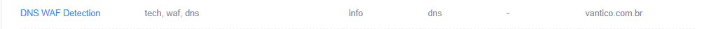
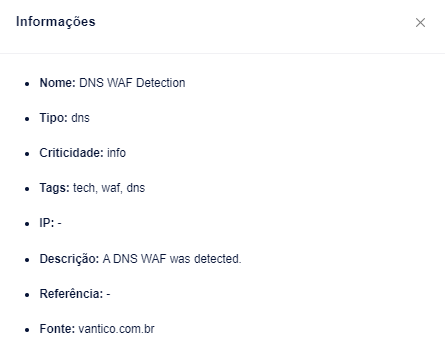

# Domínios


Digitalize seus domínios para descobrir hosts.


Um dos maiores desafios de segurança cibernética para as empresas atualmente é compreender a sua superfície de ataque completa e a sua postura de risco. Muitas vezes, as organizações podem ter ativos publicamente detectáveis que não conheciam anteriormente, deixando-as expostas a ataques.

Domínios é um recurso experimental de descoberta/monitoramento de superfície de ataque (ASM) para ajudar os clientes a entender quais hosts em seus domínios podem ser acessados externamente, garantindo que todos os ativos em seu ambiente possam ser devidamente protegidos.

Os domínios serão lançados com funcionalidades básicas que permitem aos clientes ver os hosts em seus domínios. Em última análise, os domínios crescerão em riqueza de recursos para acomodar casos de uso como:

* Riscos relacionados aos hosts, por ex. risco de aquisição de subdomínio
* Enumeração automática de domínios de provedores de DNS (por exemplo, Route53, Cloudflare, etc.)
* Associar domínios/hosts a ativos/testes/descobertas
* Verificar URLs relacionados em busca de vulnerabilidades (DAST)
* Atualizações semanais sobre novos hosts na sua superfície de ataque

**Como usar o recurso Domínios**

Vá para a guia Domínios (Beta) no menu de navegação principal esquerdo

Aqui você pode ver os Domínios que já foram adicionados, e também pode adicionar mais Domínios.

Para os Domínios já adicionados você pode ver o status do Scan e quantos Hosts foram descobertos. Você pode usar o menu lateral kebab para excluir/remover Domínios da lista.

<figure><figcaption></figcaption></figure>

Use o botão “Adicionar Domínio” para adicionar um novo Domínio.

Ao inserir um Domínio, confirme se o Domínio está associado à sua Organização.

Quando um Domínio é adicionado, a Vantico inicia uma varredura em busca de Hosts no Domínio.

A Vantico executará verificações diárias consecutivamente em todos os domínios da lista de domínios.

Quando a verificação for concluída, normalmente após alguns minutos, você verá os hosts descobertos clicando no Domínio na lista Domínios.

De relance você pode ver todos os hosts, seu status, quando o IP foi visto pela primeira vez por uma varredura e o último teste de invasão onde o host foi incluído no escopo/destinos.

<figure><figcaption></figcaption></figure>

Você pode clicar em um Host para ver mais detalhes sobre o endereço IP resolvido e as portas abertas. Atualmente a varredura não oferece suporte a IPv6. As seguintes portas são verificadas: 43, 80, 8080, 20, 21, 22, 139, 137, 445, 53, 8443, 23, 25, 69

Esses resultados referem-se aos últimos sete dias para evitar ser afetado por problemas de rede de curto prazo.

Os hosts são mostrados com os três status a seguir:

* Aberto: O host tem um IP resolvível e portas abertas
* Sem portas: o host possui um IP resolvível, mas nenhuma porta aberta
* Não utilizado: não há endereço IP resolvível

Você pode pesquisar hosts, filtrar por status e filtrar por data de quando o host foi visto pela primeira vez.

Filtrar por data pode ser útil, por exemplo. se você deseja exibir apenas hosts que foram descobertos na última semana.

**Como funciona o risco de aquisição**

O recurso Risco de aquisição considera 5 condições que, quando verdadeiras, podem indicar um risco potencial de aquisição de DNS ou subdomínio.

1. Não alcançamos um servidor com este IP, potencialmente alguém poderia iniciar um servidor com o mesmo IP. Se estiver disponível apenas na sua VPN, você também deve pensar em ter a entrada DNS disponível apenas na sua VPN.

* O que: O IP deste host parece estar offline porque não reage a nenhuma porta.
* Por quê: isso pode significar que você tem uma entrada DNS pública apontando para um IP que está disponível apenas na sua VPN. Alguém poderia iniciar um servidor com o mesmo IP em outra rede.
* Ação: Pense também em ter a entrada DNS disponível apenas na sua VPN. Este host se refere a um site ou API que não respondeu com êxito.
* Gravidade: Informativa

2. Este host refere-se a um site ou API que não respondeu com êxito.

* O quê: Este host se refere a um site ou API por meio de um registro DNS CNAME que não respondeu com êxito.
* Por quê: Isso pode significar que você se refere a uma conta ou recurso que não existe mais e pode ter sido registrado por outra pessoa.
* Ação: Verifique se o site ou API referido ainda existe e responde conforme o esperado.
* Gravidade: Baixa

3. Este host refere-se a outro domínio, mas não resolve para nenhum IP, alguém poderia registrar este domínio.

* O quê: Este host se refere a outro domínio por um registro DNS CNAME, MX ou NS que não possui um registro DNS IP.
* Por quê: isso pode significar que você se refere a um IP que não possui mais e que pode ter sido registrado por outra pessoa.
* Ação: Verifique se o domínio referido ainda existe.
* Gravidade: Baixa

4. Este host refere-se a um servidor SMTP que não respondeu com êxito.&#x20;

* O quê: Este host refere-se a um servidor smtp por um registro DNS MX que não respondeu com êxito.
* Por quê: Isso pode significar que você se refere a uma conta ou recurso que não existe mais e pode ter sido registrado por outra pessoa.
* Ação: Verifique se o servidor SMTP referido ainda existe e responde conforme o esperado.
* Gravidade: Média

5. Este host refere-se a um servidor DNS que não respondeu com sucesso.

* O que: Este host refere-se a um servidor DNS por meio de um registro DNS NS que não respondeu com êxito.
* Por quê: Isso pode significar que você se refere a uma conta ou recurso que não existe mais e pode ter sido registrado por outra pessoa.
* Ação: Verifique se o servidor DNS referido ainda existe e responde conforme o esperado.
* Gravidade: Média
