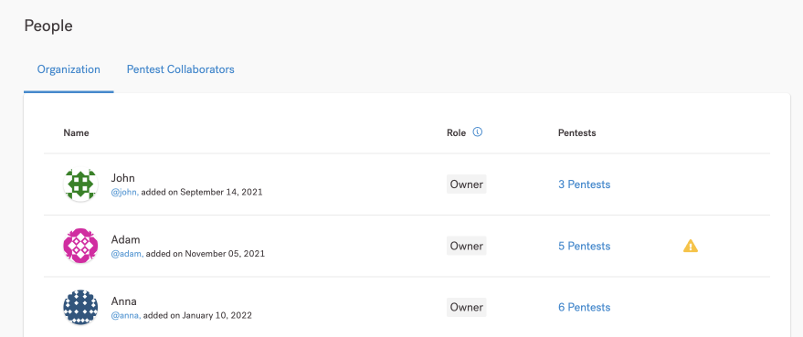

# Aplicar autenticação de dois fatores


Como proprietário da organização, você pode impor a autenticação de dois fatores (2FA) para todos os usuários da organização que se autenticam com email e senha.


**Importante saber**

Observe o seguinte sobre a aplicação de 2FA:

* A aplicação 2FA se aplica apenas a usuários que se autenticam com e-mail e senha.
* A aplicação 2FA não se aplica ao logon único (SSO). Isso inclui logon único (SSO) SAML e autenticação do Google (OAuth 2.0).
* A aplicação 2FA afeta usuários com as seguintes funções:
  * Proprietário da organização
  * Membro da Organização
  * Membro da equipe Pentest

**Aplicar 2FA**

1. Navegue até **Configurações** > **Identidade e acesso.**
2. Em Aplicar autenticação de **dois fatores (2FA),** ative o botão de alternância.
3. Na sobreposição que aparece, confirme sua ação.

Os usuários recebem uma notificação por e-mail para ativar o 2FA. Eles devem ativar o 2FA no próximo login com seu e-mail e senha.


Dica:

Se você tiver problemas para fazer login com 2FA, consulte nossas dicas de solução de problemas.


**Desativar aplicação 2FA**

1. Navegue até **Configurações** > **Identidade e acesso.**
2. Em Aplicar autenticação de **dois fatores (2FA)**, desative o botão de alternância.

Os usuários da sua organização não precisam mais ativar o 2FA. Isso não desativa o 2FA em suas contas. Recomendamos que eles continuem usando 2FA para aumentar a segurança de suas contas.

**Verifique o status 2FA dos usuários**

Para visualizar o status 2FA nas contas de usuário da sua organização, navegue até a página **Pessoas**. Você verá um ícone de aviso amarelo para um usuário quando:

* O usuário não ativou o 2FA, independentemente da aplicação do 2FA;

Não aplicamos 2FA para pentesters Vantico, mas exibimos um ícone de aviso na guia Pentest Collaborators caso eles não tenham habilitado 2FA.

<figure><figcaption></figcaption></figure>
