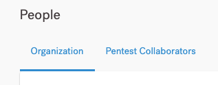
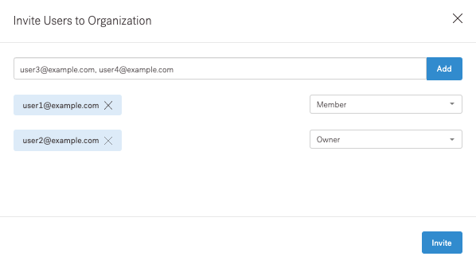
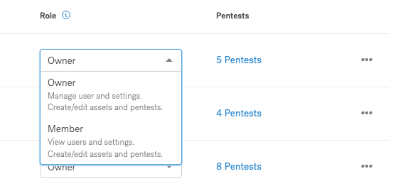
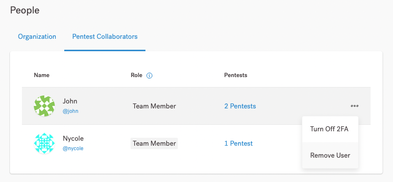

# Gerenciar usuários


Como proprietário da organização, você pode gerenciar os usuários da sua organização, além de gerenciar os colaboradores do pentest.


**Gerencie usuários da sua organização**

Navegue até a página **Pessoas** > **Organização**. Aqui você pode:

* Convidar e remover usuários
* Mude seus papéis

<figure><figcaption></figcaption></figure>

**Convidar usuários**

Para convidar usuários para sua organização:

1. No aplicativo Vantico, selecione sua organização.
2. Navegue até a página **Pessoas** e selecione **Convidar usuários**.
3. Na sobreposição exibida, especifique os endereços de e-mail dos usuários que você deseja convidar. Insira os e-mails e selecione **Adicionar** ou pressione **Enter**.

* Use vírgulas para separar vários endereços de e-mail.

4. Para cada usuário, selecione uma função: Membro ou Proprietário.

* Tanto os membros quanto os proprietários têm acesso a todos os ativos e testes de invasão de uma organização.

5. Selecione **Convidar** para confirmar.

Os usuários recebem um convite por e-mail para ingressar na sua organização. Eles também se tornam colaboradores em todos os pentests da organização como Pentest Team Members.

<figure><figcaption></figcaption></figure>

**Alterar a função de um usuário**

Para alterar a função de um usuário de Proprietário para Membro ou vice-versa, na página Pessoas, use a lista em Função.

<figure><figcaption></figcaption></figure>

**Remover usuários**

Para remover um usuário da sua organização:

1. Na página Pessoas, localize o usuário que deseja remover.
2. Selecione o ícone de três pontos à direita e selecione Remover usuário.
3. Na sobreposição exibida, selecione se deseja remover um usuário:

* Somente da organização. O usuário ainda pode colaborar em pentests como membro da equipe Pentest.
* Da organização e de todos os pentests.

**Gerenciar colaboradores do Pentest**

Na guia Pentest Collaborators da página People, você pode ver usuários que não pertencem à sua organização, mas que podem colaborar em pentests específicos. Isso inclui:

* Membros da equipe Pentest
* Pentesters Vantico

Para visualizar pentests nos quais o usuário colabora, selecione o link em Pentests. A partir daqui, você pode navegar até a página do pentest.

Os membros da equipe do Pentest que não pertencem à organização podem gerenciar colaboradores para um pentest específico.

**Remover um usuário de todos os Pentests**

Como proprietário da organização, você pode remover um membro da equipe do Pentest — que não pertence à organização — de todos os pentests em que colaboram.

1. No aplicativo Vantico, selecione sua organização no canto superior esquerdo da tela.
2. Navegue até a página **Pessoas** > **Colaboradores Pentest.**
3. Para o membro da equipe que você deseja remover, selecione o ícone de três pontos > **Remover** usuário e selecione **Sim** na sobreposição para confirmar.

<figure><figcaption></figcaption></figure>

**Adicionar um membro da equipe Pentest**

Como membro da equipe do Pentest, você pode adicionar usuários a um pentest específico. Isso não requer a função de proprietário da organização.

**Remover um membro da equipe Pentest**

Como membro da equipe do Pentest, você pode remover usuários de um pentest específico. Isso não requer a função de proprietário da organização.
