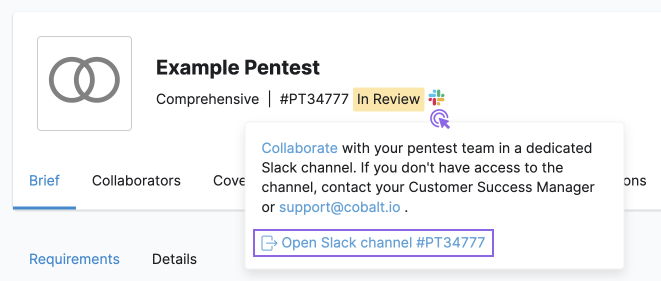
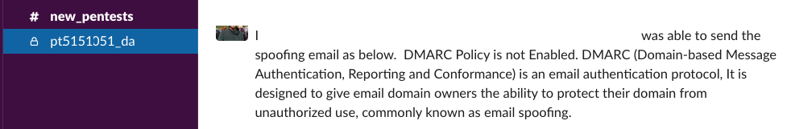
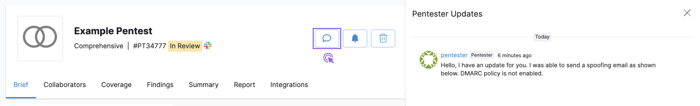

# Colabore em Pentests


Colabore com pentesters, seus colegas de equipe e a equipe da Vantico durante todo o pentest.


**Você pode usar os seguintes canais de comunicação:**

* Mensagens no aplicativo Vantico
* Um canal do Slack dedicado ao seu pentest
* Barra lateral de atualizações do Pentester no aplicativo Vantico

À medida que nossos pentesters testam seu ativo, eles atualizam você sobre o progresso em tempo real. Aqui está o que esperar:

* Os pentesters relatam vulnerabilidades que descobrem em seu software.
* Você pode receber perguntas de nossos pentesters.
* Você pode enviar comentários para pentesters e seus colegas de equipe.
* Os membros da equipe da Vantico podem entrar em contato para pedir ajuda.

**Colabore no aplicativo Vantico**


Para ativar esse recurso, entre em contato com seu Gerente de Sucesso do Cliente (CSM) ou [support@vantico.com.br](mailto:support@vantico.com.br).


Comunique-se com pentesters e colaboradores de pentest na plataforma Vantico, sem usar ferramentas de terceiros.

Navegue até Pentests, selecione um pentest e selecione o ícone de bate-papo

<figure><figcaption></figcaption></figure>

Na barra lateral que é aberta, você pode ver duas guias:

* **Atualizações do Pentester**: Leia as atualizações dos nossos pentesters enquanto eles testam seu ativo. Nesta aba, você só pode visualizar o que os pentesters postaram. Para iniciar uma conversa, vá para a guia Bate-papo.

<figure><figcaption></figcaption></figure>

* **Bate-papo**: comunique-se com pentesters, colaboradores de pentest e equipe da Vantico em tempo real.
  * Para enviar uma mensagem, insira-a no campo de entrada e selecione Comentário.
  * Para mencionar um usuário em sua mensagem, digite @ e selecione um usuário.
  * Os usuários recebem notificações por e-mail para cada menção.
  * Você pode adicionar emoji às suas mensagens.
  * Você pode editar ou excluir seus comentários depois de postados.

<figure><figcaption></figcaption></figure>

Como nossos pentesters compartilham vulnerabilidades encontradas em tempo real, você pode começar a corrigir as descobertas antes que o pentest seja concluído. Revise e analise cada descoberta. Você pode:

* Corrija a descoberta e envie-a para  re-test
* Marque a descoberta como Risco Aceito

**Use o Slack para comunicação**

Você pode se comunicar com pentesters e seus colegas de equipe em um canal do Slack dedicado ao seu pentest. Para saber mais sobre os canais do Slack, leia a documentação do Slack.

> Nota:
>
> O canal do Slack fica disponível até que seu pentest seja **fechado**.

A imagem abaixo ilustra como usar o Slack durante um pentest.

<figure><figcaption></figcaption></figure>

1. Assim que movermos seu pentest para Em revisão, criaremos um canal dedicado no Slack. Na página pentest, selecione o ícone do Slack Ícone do Slack e selecione **Open Slack Channel #.**

* Caso você não tenha acesso ao canal Slack, entre em contato com seu Gerente de Sucesso do Cliente (CSM) ou support@vantico.com.br.
* Se você é novo no Slack, leia a documentação do Slack para obter ajuda.

<figure><figcaption></figcaption></figure>

2. Adicione os colegas de sua escolha ao canal do Slack. Escolha colegas que possam se beneficiar da comunicação direta com nossos pentesters. Para saber mais sobre como adicionar usuários ao Slack, leia a documentação do Slack.
3. Depois de movermos seu pentest para Planejado, você verá seus pentesters no canal do Slack.
4. Quando o pentest entra em operação, nossos pentesters compartilham vulnerabilidades que encontram em tempo real. Comece a corrigir as descobertas antes que o pentest seja concluído. Aqui está um exemplo de mensagem de um pentester no Slack.

<figure><figcaption></figcaption></figure>

5. Revise e analise cada descoberta. Você pode:

* Corrija a descoberta e envie-a para novo teste
* Marque a descoberta como Risco Aceito

6. Mantemos o canal do Slack aberto até que você resolva todas as descobertas, o que inclui os seguintes estados:

* Risco Aceito
* Fixo

7. Arquivamos o canal do Slack assim que movemos o pentest para Fechado. Caso precise de acesso ao canal arquivado, entre em contato com seu Gerente de Sucesso do Cliente (CSM) ou support@vantico.com.br.

**Leia atualizações de pentesters**

Leia as atualizações de nossos pentesters enquanto eles testam seu ativo.

Navegue até **Pentests**, selecione um pentest e selecione o ícone de bate-papo Ícone de bate-papo. Você pode ver as mensagens dos pentesters na barra lateral que é aberta.

<figure><figcaption></figcaption></figure>
