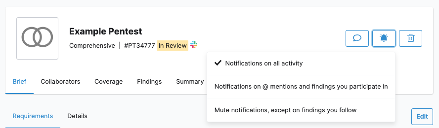
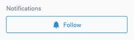
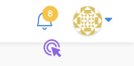
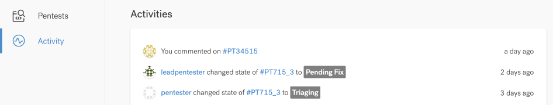

# Notificações


Você pode gerenciar notificações para testes e descobertas específicas.


Por padrão, você recebe notificações sobre algumas atividades relacionadas à sua organização e pentests – tanto por e-mail quanto no aplicativo Vantico. Se você não estiver recebendo notificações por e-mail, consulte nossas dicas de solução de problemas.

**Veja exemplos de atividades.**

Você é notificado quando alguém:

* Criou ou excluiu um pentest
* Postou uma atualização para um pentest
* Relatou uma vulnerabilidade
* Alterou um estado de descoberta
* Usuários convidados para a organização

Sua função de usuário determina quais notificações você receberá.

**Gerenciar notificações de Pentest**

Ao colaborar em um pentest, você recebe notificações dependendo de suas preferências de notificação.

Na página do pentest, selecione o ícone de sino Bell icon e defina sua preferência:

* **Notificações sobre todas as atividades**, a menos que você tenha deixado de seguir explicitamente uma descoberta. Esta é a opção padrão.
* **Notificações sobre @ menções e descobertas das quais você participa**
* **Silenciar notificações, exceto nas descobertas que você segue**

<figure><figcaption></figcaption></figure>

**Gerenciar notificações de descoberta**

Você recebe notificações de uma descoberta quando alguém:

* Designei você para a descoberta.
* Você mencionou em um comentário.
* Deixou um comentário sobre a descoberta – se você se inscreveu para receber notificações de pentest.

Se você não estiver participando, poderá assinar notificações para receber uma descoberta.

* Na página do pentest, vá para **Descobertas** e selecione uma descoberta.
* Em **Notificações**, selecione **Seguir**.

<figure><figcaption></figcaption></figure>

Para cancelar a assinatura de um tópico, selecione **Deixar de seguir.**

**Ver todas as notificações**

Para visualizar notificações de todas as organizações às quais você pertence, selecione o ícone de sino Ícone de sino no canto superior direito. O número de notificações não lidas, se houver, aparece no ícone do sino.

<figure><figcaption></figcaption></figure>

Você só vê notificações recentes no popover. Para visualizar todas as notificações, selecione o ícone de três pontos > **Ir para a página de notificações.**

* Para marcar todas as notificações como lidas, selecione Marcar todas como lidas.
* Para marcar uma única notificação como lida, selecione o ícone de ponto •.

**Ver atividade da equipe**

Para visualizar as atividades mais recentes dos membros da sua equipe e pentesters, navegue até a página Atividade. Tanto os usuários da organização quanto os membros da equipe do Pentest podem visualizar esta página.

<figure><figcaption></figcaption></figure>

**Solucionar problemas de notificações por e-mail**

Você não está recebendo e-mails do Vantico

Faça o seguinte:

* Verifique com seu administrador de TI se o domínio de e-mail vantico.com.br:
  * Não está incluído na lista de remetentes bloqueados.
  * Não aciona uma rejeição severa do Sender Policy Framework (SPF). Esta falha ocorre quando o servidor de e-mail do destinatário rejeita e-mails de endereços IP não especificados no registro SPF.
* Verifique os filtros da sua caixa de correio. Verifique se as regras que você ativou não afetam os e-mails do domínio de e-mail cobalt.io.
* Verifique se os e-mails do Vantico não estão sendo marcados como spam ou lixo eletrônico.
* Certifique-se de confirmar seu endereço de e-mail no Vantico. Para fazer isso, clique no link do convite por e-mail.

**Você está recebendo e-mails com atraso**

Isso pode acontecer porque sua organização ativou a lista cinza para e-mails. Para remediar isso, adicione o domínio de e-mail vantico.com.br à lista de permissões.

Consulte a documentação do seu sistema de gerenciamento de e-mail para obter instruções. Por exemplo, leia como configurar remetentes permitidos no Mimecast.
