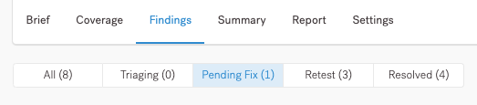
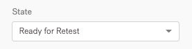
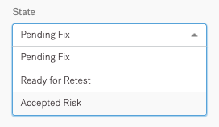
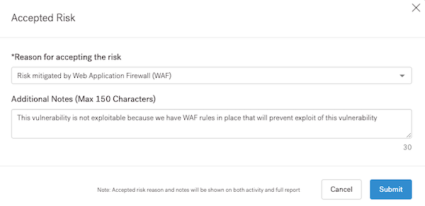
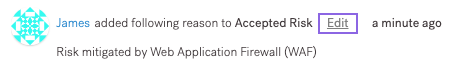
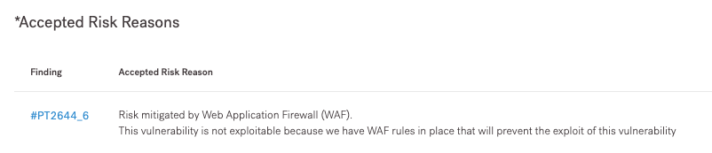

# Corrigindo Descobertas


Durante a correção, revise as descobertas descobertas pelos pentesters e tome medidas sobre elas.


Depois que os pentesters moverem uma descoberta para **Correção Pendente**, você poderá:

* Corrija a descoberta e envie-a para **re-test**
* Marque a descoberta como **Risco Aceito**

Os pentesters descrevem as descobertas e fornecem recomendações sobre como corrigi-las. Navegue até a página de descoberta para obter detalhes.

**Enviar uma descoberta para Re-test**

Depois de corrigir uma descoberta internamente, você poderá enviá-la para re-test.

1. Na guia **Descobertas** da página pentest, filtre as descobertas de **Correção Pendente.**

<figure><figcaption></figcaption></figure>

2. Selecione a descoberta desejada.
3. Na lista **Estado**, selecione **Pronto para Re-test.**

<figure><figcaption></figcaption></figure>

4. (Opcional) Deixe um comentário para pentesters. Role até o final da página, insira seu comentário e selecione **Comentário** para confirmar.

O pentester que postou a descoberta é notificado e testa novamente o problema. Quando terminar, eles alteram o estado de descoberta para:

* **Corrigido**, se eles não conseguirem reproduzir o problema.
* **Correção pendente**, se o problema persistir. Leia o comentário do pentester para obter detalhes.

> Nota:
>
> Para Pentests Ágeis e Completos realizados pelos pentesters Vantico, você pode enviar resultados para novo teste a qualquer momento:
>
> * Até ao final do período de reteste gratuito; ou
> * 10 dias antes do término do seu contrato.
>
> Os pentesters Vantico concluem o re-test dentro de sete (7) dias após o envio.

**Duração do reteste gratuito**

Para Pentests Ágeis e Completos realizados pelos pentesters da Vantico, o cronograma para reteste começa após a data de término do seu pentest dentro de um contrato ativo. Marque suas descobertas como **Prontas para Re-Test** pelo menos 10 dias antes do término do seu contrato.

* O novo teste gratuito é baseado no seu nível PtaaS:
  * Nível padrão: 6 meses
  * Níveis Premium e Enterprise: 12 meses
* O re-test gratuito está disponível apenas dentro de um contrato ativo. A data de término do novo teste será a duração do nível adquirido ou 10 dias antes da data de término do contrato (até 23h59 UTC).
* Ao iniciar um pentest logo antes do término do seu contrato, você pode não se qualificar para um novo teste. Se você adicionar um novo contrato, atualizaremos a data de término do novo teste com base no nível em que seu pentest foi planejado.

**Veja um exemplo:**

A duração do contrato padrão é de 1º de janeiro de 2022 a 31 de dezembro de 2022.

Você tem um pentest movido para Planejado em 18 de dezembro de 2022 com data de início em 20 de dezembro de 2022 e data de término em 3 de janeiro de 2023. A data de término do re-test gratuito para este pentest é 21 de dezembro de 2022, até 23h59 UTC (10 dias antes da data de término do seu contrato atual).

Então, em 30 de dezembro de 2022, você assinou um novo contrato Enterprise por um período de 1º de janeiro de 2023 a 31 de dezembro de 2023. Para recalcular a data de término do re-test gratuito para seu pentest planejado para 18 de dezembro, examinaremos o nível Padrão . Como você estendeu seu contrato, também atualizaremos a data de término do novo teste de 3 de janeiro de 2023 às 23h59 UTC até 3 de junho de 2023 às 23h59 UTC (6 meses para o nível Standard).

> Nota:
>
> Para estender a data de término do seu re-test, entre em contato com seu Gerente de sucesso do cliente (CSM) ou [support@vantico.com.br](mailto:support@vantico.com.br)

**Marcar uma descoberta como Risco Aceito**

Depois de analisar uma descoberta, você pode aceitá-la se:

* O risco associado à vulnerabilidade é baixo; ou
* Você planeja mitigar a descoberta de uma forma que não envolva uma correção técnica real.

Se você acha que uma descoberta não é uma vulnerabilidade, peça aos pentesters para reavaliá-la. Na página de descoberta, deixe um comentário explicando isso. Marque um líder de pentest (para pentests completos) ou coordenador (para pentests ágeis). Deixe a descoberta no estado Correção pendente até que seja resolvida.

* Se os pentesters confirmarem que a descoberta não é uma vulnerabilidade após reavaliá-la, eles recusarão a descoberta.
* Se os pentesters ainda considerarem a vulnerabilidade uma descoberta real, você poderá marcá-la como Risco Aceito.

Para marcar uma descoberta como Risco Aceito:

1. Na guia **Descobertas** da página pentest, filtre as descobertas de **Correção Pendente**.

<figure><figcaption></figcaption></figure>

2. Selecione a descoberta desejada.
3. Na lista **Estado**, selecione **Risco Aceito.**

<figure><figcaption></figcaption></figure>

4. Na sobreposição que aparece, selecione um motivo para aceitar o risco ou especifique o seu próprio. Você pode adicionar uma nota para fornecer mais detalhes.

<figure><figcaption></figcaption></figure>

5. Selecione **Enviar** para confirmar.

* Os usuários que têm acesso ao pentest podem ver quem aceitou o risco e visualizar todos os detalhes relacionados. Se necessário, eles podem editar o motivo e a observação.

<figure><figcaption></figcaption></figure>

No relatório do pentest, na seção Correção Pós-Teste, a descoberta aparece como Risco Aceito. Você pode ver detalhes em **Razões de risco aceitas**. Essas informações podem ser relevantes para as partes interessadas com as quais você compartilha o relatório.

<figure><figcaption></figcaption></figure>

