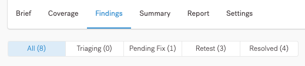

# Estados das Descobertas


Movemos o pentest para Fechado assim que você resolver todas as descobertas. Até então, o pentest está em Remediação.


Você pode filtrar as descobertas por estado na **guia Descobertas** da página do pentest.

<figure><figcaption></figcaption></figure>

| Estado da Descoberta          | Descrição                                                                                                                                                                                                                                                                                                                                                                                                                                                                                                                                                                                                                                                                                                           |
| ----------------------------- | ------------------------------------------------------------------------------------------------------------------------------------------------------------------------------------------------------------------------------------------------------------------------------------------------------------------------------------------------------------------------------------------------------------------------------------------------------------------------------------------------------------------------------------------------------------------------------------------------------------------------------------------------------------------------------------------------------------------- |
| Triagem                       | Vulnerabilidade potencial que os pentesters fazem a triagem e validam após a postagem.                                                                                                                                                                                                                                                                                                                                                                                                                                                                                                                                                                                                                              |
| Correção pendente             | 
Os pentesters validaram a descoberta e atribuíram a ela um nível de severidade com base na probabilidade de ocorrência e no impacto nos negócios. Agora você pode: 
<ul><li>Corrija a descoberta e envie-a para novo teste. Se o problema persistir após o novo teste, os pentesters moverão a descoberta de volta para Correção Pendente.</li><li>Marque a descoberta como Risco Aceito.</li></ul>                                                                                                                                                                                                                                                                                                           |
| Pronto para reteste (reteste) | 
Você corrigiu a descoberta internamente e a enviou para novo teste. Os pentesters testam novamente a descoberta e depois alteram seu estado para:
<ul><li><strong>Corrigido</strong>, se eles não conseguirem reproduzir o problema.</li><li><strong>Correção pendente</strong>, se o problema persistir. Leia o comentário do pentester para obter detalhes.</li></ul>                                                                                                                                                                                                                                                                                                                                       |
| Resolvido                     | 
Isso inclui três estados:
<ul><li><strong>Corrigido</strong>: depois de enviar a descoberta para novo teste, os pentesters verificaram que você corrigiu o problema internamente. Eles não conseguiram reproduzir o problema.</li><li><strong>Risco aceito</strong>: você aceitou a descoberta como de baixo risco.</li><li><strong>Transferido</strong>: Descobrir que você não corrigiu durante o pentest anterior para o mesmo ativo. Quando você inicia um novo pentest, criamos uma descoberta no estado Carried Over. No pentest anterior, a descoberta sempre aparece como Carried Over, mesmo que você a tenha corrigido no próximo pentest. Este status não se aplica a Pentests internos.</li></ul> |

Se você é um Pentester interno que trabalha em um Pentest interno, verá status adicionais:

* **Rascunho**: você salvou uma descoberta como rascunho.
* **Recusado**: depois de fazer a triagem de uma descoberta, você a recusa porque não é uma vulnerabilidade.
* **Fora do escopo**: A vulnerabilidade está fora do escopo deste pentest.
* **Duplicado**: A vulnerabilidade já existe no pentest.
