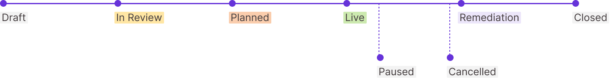

# Estados de Pentest


Aprenda o significado dos rótulos associados aos seus testes de invasão.


A partir do momento em que você começa a salvar o rascunho de um pentest, atribuímos um rótulo para esse pentest. Configuramos essas definições como se você tivesse configurado o pentest por meio de nossa interface de usuário.

<figure><figcaption></figcaption></figure>

Aqui está o significado de cada legenda:

| Legenda    | Descrição                                                                                                                                                                                                                                      |
| ---------- | ---------------------------------------------------------------------------------------------------------------------------------------------------------------------------------------------------------------------------------------------- |
| Rascunho   | Você iniciou o processo Criar um Pentest. No entanto, você pode não ter adicionado as informações necessárias para começar a trabalhar em seu pentest.                                                                                         |
| Em Revisão | Você enviou o pentest. Estamos analisando seu envio. Podemos ter perguntas para você. Este status não se aplica a **Pentests internos.**                                                                                                       |
| Planejado  | Aceitamos sua proposta de pentest. Atribuiremos pentesters com base em suas pilhas de tecnologia e metodologia. Você também deve ter acesso a um canal do Slack dedicado ao seu pentest.                                                       |
| Ao Vivo    | Começamos a trabalhar no seu pentest. Use o canal de bate-papo pentest para se comunicar diretamente com seus pentesters. Quando tivermos dúvidas e descobrirmos descobertas, as compartilharemos no canal.                                    |
| Pausada    | Não podemos continuar o pentest. Você deverá ver um motivo no canal do Slack associado ao seu pentest. Este status não se aplica a Pentests internos.                                                                                          |
| Correção   | Concluímos e compartilhamos os resultados do nosso pentest, incluindo nossas descobertas de vulnerabilidade. Você pode aceitar ou corrigir cada vulnerabilidade. Depois de concluído, reenvie sua solicitação. Testaremos novamente seu ativo. |
| Fechada    | Você pode ter aceitado nossas descobertas. Ou testamos novamente cada uma das nossas descobertas e não conseguimos reproduzi-las. Podemos não ter encontrado nenhuma vulnerabilidade ou você aceitou alguma vulnerabilidade que encontramos.   |
| Cancelada  | Se você não precisar mais de um pentest, poderá cancelá-lo. Manteremos o pentest em nossos registros caso você mude de ideia.                                                                                                                  |

> Nota:
>
> Os pentests permanecem em correção até que você resolva todas as descobertas. Você pode abordar cada descoberta:
>
> * Corrigindo a descoberta e enviando-a para re-test.
> * Aceitar a descoberta e qualquer risco de segurança associado.
