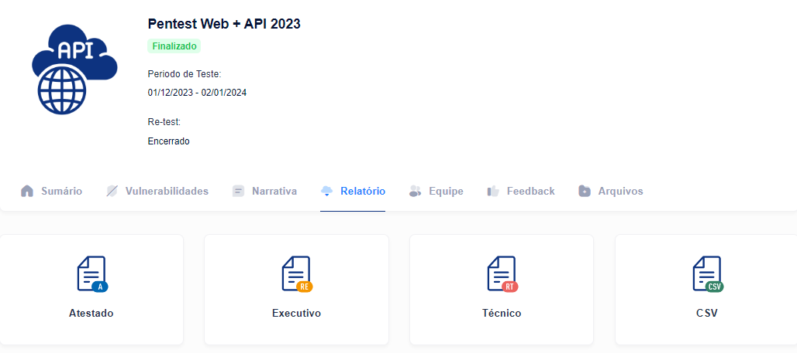

# Conteúdo de um relatório Pentest


Nossos relatórios de pentest incluem o que você precisa para proteger ainda mais seus sistemas.



Fornecemos os seguintes tipos de relatórios de pentest:

* Para testes ágeis:
  * Relatório automatizado
* Para pentests completos e internos:
  * Carta do cliente
  * Relatório de Atestado
  * Carta de Atestado
  * Relatório completo
  * Relatório completo + detalhes da descoberta

O tipo de relatório determina seu conteúdo. Se você adquiriu um nível PtaaS apropriado, poderá personalizar o conteúdo de alguns relatórios.

Selecione uma seção do relatório para navegar até ela. As seções disponíveis dependem do tipo de relatório.

<figure><figcaption></figcaption></figure>


**Alvo**

O Pentest Alvo, que indica a localização do seu ativo.


**Período de teste**

As datas do compromisso pentest.


**Teste realizado por**

Pentesters que testaram seu ativo. Cada nome de pentester inclui um link para seu perfil Vantico.


**Sumário executivo**

O resumo executivo inclui:

* Um resumo de alto nível dos testes realizados pelos pentesters
* Uma tabela com o número de descobertas que os pentesters identificaram, categorizadas por diferentes níveis de gravidade
* Destaques de quaisquer descobertas significativas


**Escopo do Trabalho**

O escopo mostrado nas subseções a seguir varia dependendo do tipo de ativo.


**Descrição do alvo**

O relatório inclui informações sobre o ativo que os pentesters testaram, juntamente com o ambiente que você especificou ao planejar o pentest:

* Produção (para usuários finais)
* Preparação (ambiente de produção futuro proposto)
* Desenvolvimento (ativo no trabalho)


**Metodologias de teste no escopo**

Nesta seção, entraremos em mais detalhes sobre os testes realizados pelos pentesters. Em geral, testamos padrões como:

* Top 10 da OWASP
* Padrão de verificação de segurança de aplicativos OWASP

Nesta seção incluímos uma lista de verificação dos testes que realizamos em seus ativos. Dependendo do seu ativo, também pode incluir etapas manuais e automatizadas que usamos com black-box e difusão baseada em gramática. Para mais informações, veja:

* Definição OWASP de Fuzzing
* Uma breve introdução ao fuzzing e por que ele é uma ferramenta importante para desenvolvedores


**Casos de teste que frustraram tentativas de exploração**

Esta seção lista os testes que não encontraram vulnerabilidades ao testar seu ativo.


**Metodologia**

Esta seção inclui metodologias básicas que os pentesters usaram antes, durante e depois do teste.


**Pré-engajamento**

* Escopo
* Cliente
* Documentação
* Informação
* Descoberta


**Teste de penetração**

* Avaliação assistida por ferramentas
* Avaliação manual
* Exploração
* Análise de risco
* Comunicando


**Pós-engajamento**

* Correção priorizada
* Suporte às melhores práticas
* Re-test


**Fatores de risco**

Usamos uma versão modificada da Metodologia de Classificação de Risco OWASP, com base em seu impacto e probabilidade nos negócios. Medimos cada fator em uma escala de 1 (muito baixo) a 5 (muito alto).


**Definições de gravidade**

Com base nos Fatores de Risco, atribuímos uma classificação a cada achado, utilizando a seguinte equação:

```
Risco = Impacto * Probabilidade
```

Para obter mais informações, consulte nossa documentação sobre **níveis de gravidade.**


**Resumo das Constatações**

Quando viável, esta seção inclui gráficos que categorizam as vulnerabilidades por:

* Tipo
* Gravidade


**Análise**

Um breve resumo de cada vulnerabilidade. Se você tiver um relatório completo + detalhes da descoberta, poderá encontrar mais informações sobre cada vulnerabilidade no apêndice em Detalhes da descoberta.

Quando aplicável, esta seção também inclui uma lista de portos e serviços abertos.


**Perfil Geral de Risco**

Incluímos um gráfico codificado por cores com base no impacto e na probabilidade de cada vulnerabilidade.


**Recomendações**

Esta seção inclui recomendações dos pentesters sobre o que você pode fazer para mitigar e remediar cada descoberta.


**Correção pós-teste**

Esta seção inclui o tipo, a gravidade e o estado de cada descoberta, bem como se a descoberta foi resolvida.

Para descobertas que você corrigiu ou marcou como risco aceito, você pode ver uma data em que foi resolvido.


**Termos**

Esta seção inclui uma isenção de responsabilidade. Os termos não aparecem nos relatórios de Pentests internos.


**Apêndice A - Detalhes da Localização**

Nesta seção, você pode ver detalhes de cada descoberta. Isso inclui o seguinte:

* Tipo de vulnerabilidade
* Descrição
* URLs afetados
* Prova de conceito da vulnerabilidade
* Gravidade
* Correção sugerida
