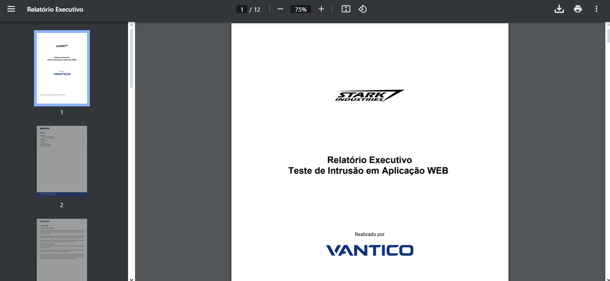
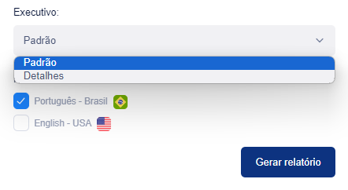

# Customize seu Relatório de Pentest


Se permitido pelo seu nível PtaaS, você pode personalizar relatórios para pentests completos e internos.


Os relatórios de pentest estão disponíveis quando o pentest está no estado Correção ou Fechado.

Para personalizar um relatório:

1. No aplicativo Vantico, selecione **Pentests** e, em seguida, selecione **Correção** ou **Fechado** na lista **Estado**.
2. Selecione um pentest e selecione a guia **Relatório**. Você verá seções de relatórios, juntamente com a lista de **relatórios** que permite selecionar entre os tipos de relatórios de pentest.
3. Agora você pode personalizar o tipo de relatório selecionado. Selecione **Personalizar** e vá até uma seção do relatório.
4. Se quiser deixar de fora uma seção do relatório, selecione o ícone de olho próximo ao título da seção.

* Você não pode ocultar o Resumo Executivo.
* Para uma Carta de Atestado, os títulos das seções não aparecem. Você só pode ocultar uma tabela de resumo geral de descobertas.

<figure><figcaption></figcaption></figure>

5. Quando terminar de personalizar seu relatório, vá até o topo da página e selecione **Aplicar**.
6. Agora você pode selecionar **Baixar** para baixar seu relatório de pentest, como um arquivo PDF, com as alterações configuradas.

> Nota:
>
> A menos que você tenha personalizado um relatório, você não verá a opção Relatório Personalizado na lista de tipos de relatório. Se você repetir o processo, substituirá qualquer relatório personalizado existente.
>
> 
