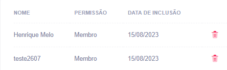
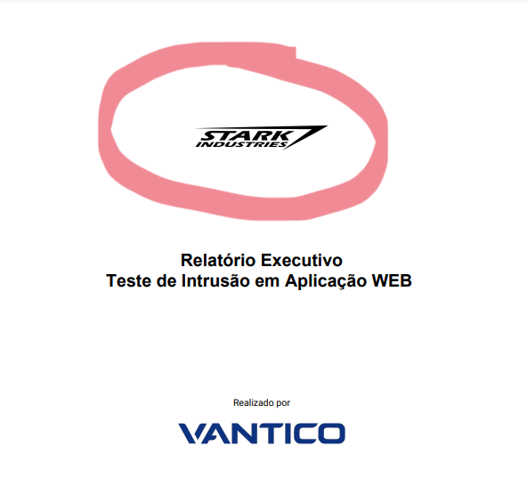

# Relatórios de Pentest de marca conjunta


Se sua organização gerencia testes de invasão para terceiros, você poderá adicionar o logotipo da sua empresa a todos os relatórios de testes de invasão. Em relatórios de marca conjunta, o logotipo da sua empresa aparece ao lado do logotipo da Vantico.


Como proprietário da organização de uma empresa parceira, você pode habilitar relatórios de marca conjunta para suas organizações clientes.

**Habilitar relatórios de marca conjunta**

Para começar, solicite a ativação da funcionalidade de co-branding para você.

**Ver Instruções:**

Envie uma solicitação para [support@vantico.com.br](mailto:support@vantico.com.br) com os seguintes detalhes:

* Seu nome
* Nome da sua organização
* Lista de organizações clientes que você gerencia
* Assunto: Ativar a funcionalidade de co-branding de parceiros

Assim que processarmos sua solicitação, você se tornará um Parceiro Vantico. Agora você pode gerenciar relatórios de marca conjunta para suas organizações clientes.

Para garantir que você tenha essa permissão habilitada, navegue até a página Pessoas.

<figure><figcaption></figcaption></figure>

Para ativar relatórios de marca conjunta para uma organização cliente:

1. Selecione a organização no canto superior esquerdo.
2. Navegue até a página **Configurações**.
3. Em **Marca do Relatório**, carregue o logotipo da sua empresa seguindo as instruções na IU.
4. Selecione **Aplicar a imagem carregada** como logotipo de marca conjunta e selecione Salvar.

* Você pode alterar o logotipo posteriormente.

5. Para verificar se o co-branding está ativado:

* Vá para a página **Pentests** e selecione um pentest no estado Correção ou Fechado.
* Na guia **Relatório**, baixe um relatório e verifique se ele contém o logotipo da sua empresa.

<figure><figcaption></figcaption></figure>

**Desativar relatórios de marca conjunta**

Para desativar relatórios de marca conjunta para uma organização cliente:

* Selecione a organização no canto superior esquerdo.
* Navegue até a página **Configurações**.
* Desmarque a caixa de seleção **Aplicar a imagem carregada** como logotipo de marca compartilhada e selecione **Salvar**.

Os relatórios de Pentest desta organização não terão mais o logotipo da sua empresa.
