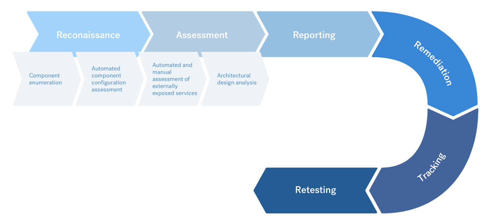

# Metodologias de Configuração Cloud

Nossos pentesters testam seus ativos rigorosamente.


Apoiamos testes de penetração de sistemas nos seguintes ambientes de nuvem:

* Amazon AWS&#x20;
* Google Cloud Platform (GCP)&#x20;
* Microsoft Azure

Embora realizemos muitos dos mesmos testes em diferentes configurações de nuvem, cada ambiente possui requisitos de teste exclusivos.


**Teste de rede em nuvem**

Testamos ativos em nuvem com base nas metodologias de teste de nuvem listadas nesta página. Se você deseja um teste de rede do seu ativo em nuvem, solicite-nos um **teste de rede externo.**


**Requisitos Comuns**

A Vantico avalia o ambiente de nuvem selecionado, bem como todos os componentes internos e externos. A Vantico segue uma metodologia padrão da indústria baseada principalmente em:

* Melhores práticas estabelecidas pelo seu provedor de nuvem&#x20;
* Padrões OWASP para provedores de nuvem (PDF) e padrão de verificação de segurança de aplicativos (ASVS).

A equipe de pentesters do Vantico não precisa de acesso ao código-fonte da aplicação web subjacente, a menos que você o especifique como um requisito.

Seguimos uma metodologia padrão da indústria baseada principalmente no Guia de Testes OWASP ASVS. Nossa equipe segue as seguintes etapas para garantir cobertura total:

* Reconhecimento de escopo alvo&#x20;
* Enumeração de componentes&#x20;
  * Baseado na descoberta automatizada de componentes&#x20;
* Avaliação automatizada de configuração de componentes&#x20;
  * Riscos detalhados, com base nas práticas recomendadas do Center for Internet Security (CIS)&#x20;
* Revisão automatizada/manual de serviços expostos externamente&#x20;
  * Avaliações básicas de vulnerabilidade&#x20;
* Análise de projeto arquitetônico&#x20;
* Relatórios, triagem e re-tests


<figure><figcaption></figcaption></figure>

Em geral, os provedores de nuvem com os quais trabalhamos não precisam mais saber antes de realizarmos nossos testes de invasão. No entanto, cada fornecedor de nuvem pode ter o seu próprio procedimento. Incluímos links para procedimentos que conhecemos na seção de cada provedor.


**Endereços IP de origem**

Os provedores de nuvem podem precisar incluir endereços IP associados ao tráfego de pentest em sua lista de permissões. Compartilharemos esses endereços quando você criar um pentest real.


**Parâmetros de teste**

Quando você cria um pentest que envolve um provedor de nuvem, compartilharemos as informações que seu provedor de nuvem pode exigir, incluindo:

* Largura de banda máxima&#x20;
* Pico de consultas por segundo&#x20;
* Requisitos de tráfego de escalonamento&#x20;
* Informações para contato de emergência


**Amazon AWS**

Nossos pentesters precisam de acesso para testar seus sistemas AWS. Para isso, você deve preparar:

* Uma conta AWS dedicada para cada pentester, com acesso a cada sistema de destino.
  * &#x20;Credenciais da API de gerenciamento de identidade e acesso (IAM) para cada conta da AWS afetada.&#x20;
    * Inclua as seguintes políticas gerenciadas para o usuário ou função do pentest:&#x20;
      * _Auditoria de segurança_&#x20;
      * _Ver apenas acesso_

Estas são as políticas obrigatórias de nomes de recursos da Amazon (ARN):

```
arn:aws:iam::aws:policy/SecurityAudit
arn:aws:iam::aws:policy/job-function/ViewOnlyAccess
```

Você também deve incluir a arquitetura da configuração da sua nuvem.


**O que está coberto**

As análises de configuração da nuvem atendem aos padrões de segurança baseados nos benchmarks do Center for Internet Security (CIS). Os benchmarks AWS CIS abrangem IAM, armazenamento, registro, monitoramento e rede.


**Categorias de verificações específicas cobertas como parte do Pentest**

1. AWS Cloudtrail
2. AWS Cloudwatch
3. AWS EC2
4. AWS ELB
5. AWS IAM
6. AWS RDS
7. AWS Redshift
8. AWS Route 53
9. AWS S3
10. AWS SES
11. AWS SNS
12. AWS SQS
13. AWS VPC


**Google Cloud Platform (GCP)**

Nossos pentesters precisam de acesso para testar seus sistemas GCP. Para isso, você deve preparar:

* Uma conta GCP dedicada para cada pentester, com acesso a cada sistema de destino.&#x20;
  * Chaves de acesso do GCP.&#x20;
  * Credenciais da API Identity and Access Management (IAM) para cada conta do GCP afetada.
    * &#x20;Para fornecer credenciais de API, use uma conta (de serviço) com permissões de Visualizador e Revisor de Segurança


**O que está coberto**

As análises de configuração da nuvem atendem aos padrões de segurança baseados nos benchmarks do Center for Internet Security (CIS). Os benchmarks CIS do GCP abrangem IAM, armazenamento, geração de registros, monitoramento, máquinas virtuais, serviços de banco de dados Cloud SQL, BigQuery e rede.


**Categorias de verificações específicas cobertas como parte do Pentest**

* Gerenciamento de identidade e acesso do GCP&#x20;
* Registro e monitoramento do GCP&#x20;
* Rede do GCP&#x20;
* Máquinas virtuais do GCP&#x20;
* Armazenamento do GCP&#x20;
* Serviços de banco de dados SQL Cloud do GCP&#x20;
* Google Cloud BigQuery


**Microsoft Azure**

Nossos pentesters precisam de acesso para testar seus sistemas Azure. Para isso, você deve preparar:

* Uma conta Azure dedicada para cada pentester, com acesso a cada sistema alvo.&#x20;
  * Credenciais da API de gerenciamento de identidade e acesso (IAM) (somente leitura) para cada conta dedicada.


**O que está coberto**

As análises de configuração da nuvem atendem aos padrões de segurança baseados nos benchmarks do Center for Internet Security (CIS). Os benchmarks do Azure CIS abrangem IAM, Microsoft Defender, contas de armazenamento, serviços de banco de dados, registro em log, monitoramento, Key Vault, AppService e rede.


**Categorias de verificações específicas cobertas como parte do Pentest**

1. Gerenciamento de identidade e acesso&#x20;
2. Microsoft Defender&#x20;
3. Contas de armazenamento&#x20;
4. Serviços de banco de dados&#x20;
5. Registro e monitoramento&#x20;
6. Rede&#x20;
7. Máquinas virtuais&#x20;
8. Cofre de chaves&#x20;
9. Serviço de aplicativo


**Outros provedores de nuvem**

Fizemos testes de invasão em outros provedores de nuvem. Você pode consultar os **Requisitos Comuns** listados anteriormente.


> Nota:
>
> Os provedores de nuvem podem exigir notificação antes de realizarmos um pentest. Para obter mais informações, consulte a documentação do seu provedor de nuvem.


**Requisitos adicionais**

Você pode definir objetivos de teste adicionais. Se você seguir práticas recomendadas além de OWASP, ASVS ou OSSTMM, informe-nos. Inclua um link ou outra documentação. Se for uma prática de segurança “bem conhecida”, nossos pentesters provavelmente já a conhecem!

Se você tiver instruções especiais para um pentest, adicione-as mais tarde, em **Instruções Especiais.**
