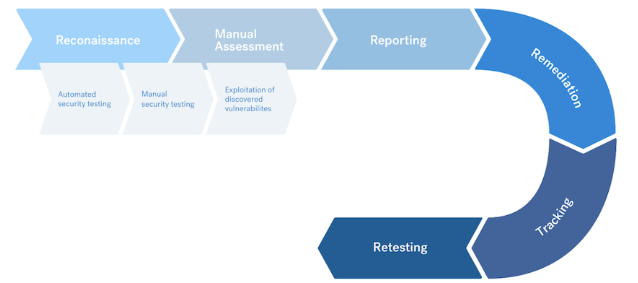

# Metodologias Mobile

O teste de penetração de aplicativos móveis é um processo no qual um testador usa ataques simulados para identificar possíveis vulnerabilidades de segurança em um aplicativo móvel.,

Seguimos uma metodologia padrão do setor baseada principalmente no Padrão de Verificação de Segurança de Aplicativos Móveis (MASVS) e no Guia de Teste (MASTG) da OWASP. Saiba mais sobre o OWASP Mobile Application Security (MAS).

<figure><figcaption></figcaption></figure>

O teste de penetração de um aplicativo móvel inclui as seguintes etapas:

* Reconhecimento de escopo alvo&#x20;
* Testes automatizados e manuais&#x20;
* Explorar vulnerabilidades descobertas&#x20;
* Relatórios, triagem e novos testes

Os pentesters Vantico não precisam de acesso ao código-fonte do seu aplicativo, a menos que você o especifique como um requisito.

Observamos a lógica do aplicativo trabalhando com seu aplicativo. Para apoiar nossos pentesters, compartilhe os arquivos IPA (iOS) e/ou APK (Android) ao definir seus ativos. Você também pode compartilhar essas informações no canal privado do Slack para seu pentest.

**Reconhecimento do Escopo Alvo**

Com base no briefing do pentest preparado pelo cliente, os pentesters da Vantico buscam informações sobre os alvos e investigam o escopo. Essas informações incluem:

* Noções básicas sobre fluxos de trabalho&#x20;
* Compreendendo a lógica de negócios&#x20;
* Mapeando a superfície de ataque do aplicativo

Os pentesters então confirmam que podem:

* Alcançar e escanear os alvos&#x20;
* Testar a funcionalidade do aplicativo

**Testes automatizados e manuais**

Nossos pentesters usam uma variedade de técnicas manuais e ferramentas automatizadas para garantir uma cobertura adequada. Eles analisam seu aplicativo móvel dinamicamente. Eles também avaliam o arquivo, bem como o arquivo local.

Nossos pentesters se concentram em:

* Canais de comunicação&#x20;
* Tráfego que o aplicativo troca com endpoints externos&#x20;
* Comunicação entre processos (IPC)

Nossos pentesters também podem fazer engenharia reversa do aplicativo para obter insights e tentar acessar dados confidenciais.

Para testes de backend, eles usam **metodologias API Pentest.**

**Ferramentas:**

Os pentesters Vantico podem usar ferramentas como:

* MobSF&#x20;
* Frida&#x20;
* Apktool&#x20;
* Dex2Jar&#x20;
* Objection

As ferramentas que nossos pentesters usam durante cada fase de teste podem variar de teste para teste.

**Explorar vulnerabilidades descobertas**

Quando nossos pentesters descobrem uma vulnerabilidade, eles usam diversas técnicas para medir o impacto nos seguintes aspectos dos seus dados:

* Confidencialidade&#x20;
* Integridade&#x20;
* Disponibilidade

Nossos pentesters usam diversas técnicas para explorar o armazenamento de dados, permissões de plataforma e outros controles de segurança relevantes.

**Relatórios, triagem e novo teste**

Os pentesters Vantico relatam e fazem a triagem de todas as vulnerabilidades durante a avaliação. Você pode revisar os detalhes de todas as descobertas, em tempo real, por meio da plataforma Vantico. Nessas descobertas, assim como em qualquer relatório, nossos pentesters incluem informações detalhadas sobre como você pode:

* Corrija cada descoberta&#x20;
* Melhore sua postura geral de segurança

Você pode corrigir as descobertas durante e após o pentest. Em seguida, você pode enviar as descobertas para novo teste. Nossos pentesters testam os componentes atualizados e testam novamente os problemas para garantir que não haja riscos residuais relacionados à segurança.
