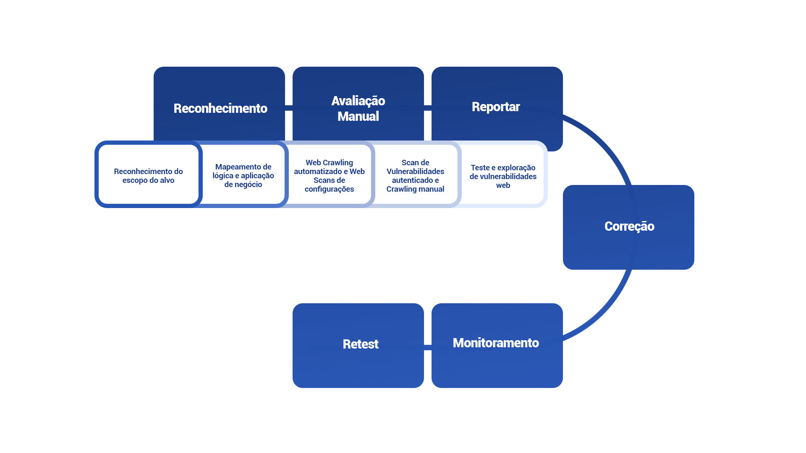

# Metodologias WEB

O teste de penetração de aplicativos da Web é um processo no qual um testador usa ataques simulados para identificar possíveis vulnerabilidades de segurança em um aplicativo da Web.

Seguimos uma metodologia padrão do setor baseada principalmente no OWASP Application Security Verification Standard (ASVS) e no Guia de Testes. No suporte, utilizamos diversas ferramentas manuais e automatizadas, descritas nas etapas a seguir, para garantir cobertura total.

<figure><figcaption></figcaption></figure>

O teste de penetração de um aplicativo web inclui as seguintes etapas:

* Reconhecimento de escopo alvo
* Mapeamento lógico de negócios e aplicativos
* Rastreamento automatizado da web e ajustes de configuração do scanner da web
* Verificação de vulnerabilidade autenticada/rastreamento manual
* Testes manuais de vulnerabilidade da web/revisões de exploração/microsserviços
* Avaliações contínuas
* Relatórios, triagem e novos testes

> Nota:
>
> As ferramentas que nossos pentesters usam durante cada fase de teste podem variar de teste para teste.
>
> Os pentesters Vantico não precisam de acesso ao código-fonte do seu aplicativo, a menos que você o especifique como um requisito. Observamos a lógica do aplicativo trabalhando com seu aplicativo.
>
> Os testes de um ativo da Web incluem testes de APIs usadas para preencher o conteúdo desse ativo. Se você tiver APIs adicionais, considere configurar:
>
> * Um teste combinado Web + API
> * Um teste separado para APIs

**Reconhecimento do Escopo Alvo**

Com base no briefing do pentest preparado pelo cliente, os pentesters da Vantico buscam informações sobre os alvos e investigam o escopo.

Essas informações incluem:

* URLs de aplicativos da Web
* Descrições da lógica do aplicativo
* Funções críticas para o negócio

Os pentesters então confirmam que podem:

* Alcançar e escanear os alvos
* Teste a funcionalidade do aplicativo

**Ferramentas:**

Os pentesters Vantico podem usar ferramentas de varredura de reconhecimento, como:

* Recon-ng
* Dnscan
* Dirble
* Aquatona
* Masscan

**Mapeamento lógico de negócios e aplicativos**

Os pentesters examinam manualmente os aplicativos de destino para mapear:

* Funções empresariais
* Fluxos de trabalho
* Processos subjacentes

Eles também criam uma matriz de controles de acesso no aplicativo com base nas funções e ações suportadas. Nossos pentesters usam essa matriz para planejar testes de segurança adicionais, que determinam:

* Quão bem esses controles são aplicados
* Como um invasor pode contornar esses controles

**Ferramentas:**

Os pentesters Vantico podem usar ferramentas de análise lógica de aplicação, como:

* Burp Suite Pro/Community
* Postman
* OWASP Zed Attack Proxy

**Rastreamento automatizado da Web Crawnling e configurações e ajustes Web Scanner**

Nossos pentesters usam ferramentas de segurança comerciais e gratuitas para avaliar o aplicativo alvo. Eles modificarão essas ferramentas conforme necessário, para garantir que a varredura possa encontrar problemas de segurança em cada segmento do seu ativo e no aplicativo como um todo.

Além disso, nossos pentesters executam rastreamentos automatizados para:

* Identifique todas as páginas disponíveis para usuários não autenticados
* Determine a árvore completa do site

**Ferramentas:**

Os pentesters Vantico podem usar ferramentas de rastreamento e web crawling, como:

* Nmap
* Burp Suite Pro/Community
* Nikto

**Escaneamento de Vulnerabilidade Autenticada / Manual Crawling**

Nesta parte do processo de pentest, nossos pentesters:

* Use ferramentas automatizadas para rastreamento de aplicativos da web
  * Verifique os resultados manualmente
* Execute testes crawnling manuais para melhor cobertura
  * Verifique a autenticação em áreas protegidas do aplicativo

Com a verificação automatizada, nossos pentesters:

* Avalie o aplicativo usando as sessões autenticadas, quando aplicável

Nossos pentesters tomam extremo cuidado para minimizar o impacto no sistema alvo.

**Ferramentas:**

Os pentesters Vantico podem usar ferramentas de verificação de vulnerabilidades, como:

* WPScan
* Burp Suite Pro/Community
* sqlmap

**Testes manuais de vulnerabilidade da Web/Revisões de Exploração/Microsserviços**

Os pentesters Vantico usam testes manuais assistidos por ferramentas para identificar e analisar as seguintes partes do aplicativo em busca de vulnerabilidades:

* Funcionalidade
* Lógica de negócios
* Implantação

A avaliação identifica vulnerabilidades publicadas, incluindo aquelas listadas no:

* OWASP Top 10
* Relatórios CVE ou rastreados por entradas CVE

Nossos pentesters também levam em consideração os fluxos de trabalho e a lógica de negócios quando identificam vulnerabilidades no aplicativo.

A avaliação inclui testes para vulnerabilidades como:

* Ataques de injeção que testam a robustez das rotinas de validação de servidor
* Falhas no gerenciamento de sessões que poderiam permitir a representação do usuário
* Falhas no controle de acesso que expõem dados ou permitem que os usuários obtenham privilégios elevados

Se a aplicação incluir microsserviços, nossos pentesters se concentram nas interações entre diferentes sistemas. Eles examinam a implementação de:

* Gerenciamento de controle de acesso
* Cross-Origin Resource Sharing (CORS)

Examinamos minuciosamente:

* Gerenciamento de controle de acesso
  * Implementação Cross-Origin Resource Sharing (CORS)
* Vulnerabilidades descritas no Projeto de Segurança da API OWASP

Para cada descoberta, os pentesters determinam o risco associado a cada problema:

* Demonstrando como o problema pode ser explorado
* Avaliar seu impacto no contexto da função de negócios, dos dados e dos usuários do ativo
* Configurando uma exploração de prova de conceito para:
  * Demonstrar a presença da vulnerabilidade
  * Minimize o potencial impacto adverso para o aplicativo, seus dados e seus sistemas subjacentes

**Ferramentas:**

Os pentesters Vantico usam várias ferramentas de teste e exploit, como:

* Burp Suite Pro/Community
* OWASP ZAP
* Dirble
* Nuclei

**Avaliações contínuas**

Nossos pentesters reportam suas descobertas, em tempo real, através da plataforma Vantico. Eles também:

* Avaliam todos os riscos
* Recomendam etapas para correção

Você está convidado a se comunicar com nossos pentesters sobre cada uma de suas descobertas.

**Relatórios, triagem e Re-Test**

Os pentesters Vantico relatam e fazem a triagem de todas as vulnerabilidades durante a avaliação. Você pode revisar os detalhes de todas as descobertas, em tempo real, por meio da plataforma Vantico. Nessas descobertas, assim como em qualquer relatório, nossos pentesters incluem informações detalhadas sobre como você pode:

* Corrigir cada descoberta
* Melhorar sua postura geral de segurança

Você pode corrigir as descobertas durante e após o pentest. Em seguida, você pode enviar as descobertas para re-test. Nossos pentesters testam os componentes atualizados e testam novamente os problemas para garantir que não haja riscos residuais relacionados à segurança.
