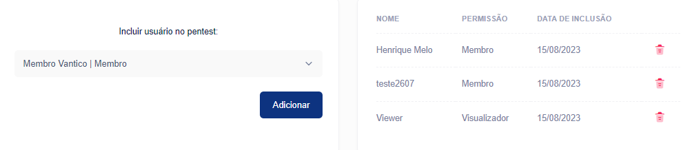

# Gerenciar colaboradores do Pentest


Navegue até **Colaboradores** na página do pentest. Aqui você pode ver os usuários que têm acesso ao pentest, incluindo pentesters.


Como membro da equipe Pentest, você pode gerenciar usuários para um pentest específico:

* Adicionar membros da equipe Pentest
* Remover membros da equipe Pentest

**Adicionar um membro da equipe Pentest**

Para adicionar um membro da equipe do Pentest a um pentest específico:

* No aplicativo Vantico, selecione **Pentests** e localize o pentest desejado.
* Na página do pentest, vá para **Colaboradores**.
* Insira o endereço de e-mail do usuário e selecione **Adicionar membro da equipe.**

O usuário recebe um convite para colaborar no pentest.

<figure><figcaption></figcaption></figure>

**Remover um membro da equipe Pentest**

Para remover um membro da equipe Pentest de um pentest:

* No aplicativo Vantico, selecione Pentests e localize o pentest desejado.
* Na página do pentest, vá para Colaboradores.
* Localize o usuário que deseja remover, selecione o ícone Remover usuário da lixeira e selecione Sim na sobreposição para confirmar.

> Nota:
>
> Como proprietário da organização, você pode remover um membro da equipe do Pentest — que não pertence à organização — de todos os pentests em que colaboram. Para obter detalhes, consulte **Remover um usuário de todos os Pentests.**
