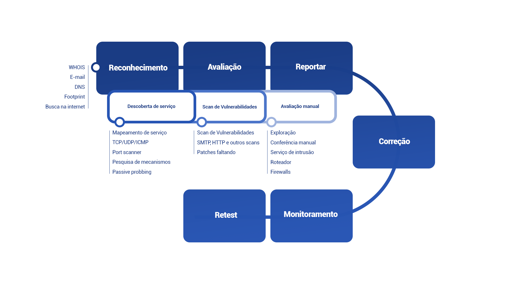

# Pentest rede interna

O teste de invasão de rede interna é um processo no qual um testador usa ataques simulados para identificar possíveis vulnerabilidades de segurança em uma rede interna.

Seguimos uma metodologia padrão do setor baseada principalmente no Manual de Metodologia de Teste de Segurança de Código Aberto (OSSTMM).

<figure><figcaption></figcaption></figure>

O teste de invasão de uma rede interna inclui as seguintes etapas:

* Reconhecimento de escopo alvo&#x20;
* Descoberta de serviço&#x20;
* Verificações de vulnerabilidade&#x20;
* Avaliação manual&#x20;
* Testes adicionais
* Relatórios, triagem e re-tests

> Nota:
>
> As ferramentas que nossos pentesters usam durante cada fase de teste podem variar de teste para teste.

A equipe de avaliação de segurança da Vantico realiza testes sem o seguinte, a menos que seja exigido como parte do escopo do pentest:

* Diagramas detalhados de rede ou infraestrutura&#x20;
* Quaisquer contas ou informações adicionais do usuário&#x20;

No entanto, você pode adicionar diagramas de rede e outros detalhes ao **descrever seu ativo.**

**Pré-requisitos**

Como os pentesters Vantico executam testes de pentes para redes internas remotamente, eles precisam:

* Acesso à rede corporativa interna através de uma conexão VPN estável&#x20;
* Um servidor Linux leve dentro da rede que serve como uma caixa de salto a partir da qual os pentesters podem verificar e testar a rede interna durante a avaliação

Dependendo da configuração da sua rede, faça o seguinte:

*   Para redes executadas em máquinas Amazon Web Services (AWS):&#x20;

    * Crie uma máquina virtual (VM) Kali dentro da AWS.&#x20;
    * Configure o acesso SSH baseado em chave para cada pentester.&#x20;

    Para redes que não usam uma configuração de rede na nuvem:

    * Baixe uma imagem Kali VMWare/VirtualBox.&#x20;
    * Configure o acesso SSH baseado em chave para cada pentester.

> Nota:
>
> Os recursos de sistema recomendados para a imagem virtual (VMWare, VirtualBox ou AWS) devem ser pelo menos:
>
> * 2 CPUs virtuais alocadas&#x20;
> * 8 GB de RAM&#x20;
> * 20 GB de espaço em disco&#x20;
>
> Os pentesters também precisam de acesso Root ao Kali VM, que é obrigatório.

**Reconhecimento do Escopo Alvo**

Os pentesters Vantico procuram todas as informações que um usuário mal-intencionado possa encontrar. Por exemplo, para se conectar à Internet, você normalmente compartilha algumas informações:

* Para receber e-mail, você precisa postar um endereço de servidor de e-mail.&#x20;
* Para configurar um servidor web, você precisa postar seu URL e muito mais.

Um invasor pode ter vários caminhos de exploração. Os pentesters Vantico exploram todos esses caminhos para coletar informações que um invasor poderia usar para obter acesso a recursos internos, como:

* Credenciais de força bruta usando formatos de e-mail corporativos descobertos&#x20;
* Construindo dicionários de senha contendo informações comerciais públicas do site corporativo

Durante a fase inicial de testes, os pentesters determinam quais informações estão disponíveis publicamente. Eles examinam o seguinte:

* **Seu site corporativo**. Os pentesters da Vantico avaliam seu site de maneiras que podem interessar a um invasor em potencial, incluindo:&#x20;
  * Locais (URL)&#x20;
  * Detalhes de contato, como números de telefone, e-mails ou endereços físicos Informações de domínio&#x20;
  * Links para outros servidores dentro de uma organização&#x20;
  * Outras empresas com links para o seu site&#x20;
  * Informações sobre a política de segurança da sua organização
* **Outros locais da web e bancos de dados**. Os pentesters Vantico procuram informações sobre seus ativos em outros sites e bancos de dados, especialmente qualquer coisa relacionada a empresas de capital aberto. Os pentesters então avaliam quais informações a organização torna públicas, especialmente qualquer coisa que vá além do exigido pelas leis locais. Eles também avaliam artigos de notícias e comunicados de imprensa em busca de mais pistas sobre sua política de segurança.
* **Seus nomes de domínio.** Os pentesters Vantico usam bancos de dados “whois” para identificar os domínios que você possui. Esses domínios fornecem informações sobre sua infraestrutura de rede.
* **Dados públicos.** Os registros públicos sobre sua organização podem incluir informações sobre as pessoas responsáveis pela administração do seu domínio, como nome, endereço ou número de telefone. Os invasores podem usar engenharia social para obter informações adicionais, como detalhes de compras de hardware e software. Também fornece pistas sobre onde pode ser o melhor local para direcionar um ataque.

**Ferramentas:**

Durante esta fase de testes, os pentesters usam várias ferramentas, como:

* Nmap
* Nikto
* Shodan

**Descoberta de serviço**

Depois de reunir todas as informações disponíveis, nossos pentesters investigam os recursos pertencentes à organização visada. Esses testes envolvem várias etapas:

* Varreduras de portas&#x20;
* Teste para PCI, se necessário&#x20;
* Investigação aprofundada

**Ferramentas:**

Durante esta fase de testes, os pentesters usam várias ferramentas, como:

* Nmap
* Nikto
* Metasploit
* Nessus
* testssl.sh

Como certas vulnerabilidades e explorações podem paralisar, danificar ou alterar o conteúdo da rede, nossos pentesters não realizam esses ataques. Eles anotam os possíveis riscos. Por exemplo, nossos pentesters não executarão explorações que:

* Desative certos serviços&#x20;
* Negar serviço de sistemas externos&#x20;
* Pode afetar os clientes (como um ataque de negação de serviço (DoS))&#x20;
* Desabilitar a capacidade de funcionamento de uma organização

**Varreduras de portas**

Os pentesters realizam uma varredura completa de portas nos intervalos de rede internos fornecidos. Isso fornece uma análise detalhada das máquinas e recursos em execução na rede corporativa e das funções que eles desempenham.

Com base nos resultados da varredura inicial de portas, os pentesters da Vantico identificaram o seguinte:

* Descoberta de hosts
* Identificação de portas
* Números de versão dos serviços em execução
* Sistemas operacionais (SO) em uso

Por exemplo, os seguintes serviços requerem acesso à rede para funcionar:

* Antivírus&#x20;
* Servidores de backup e arquivos&#x20;
* Servidores de correio&#x20;
* Servidores de implantação da Web e de patches&#x20;
* Impressoras&#x20;
* Servidores FTP&#x20;
* Servidores e clientes do Azure Active Directory (AD)
* Servidores de e-mail

Todos esses serviços deixam assinaturas características que uma varredura de porta pode detectar.

**Ferramentas:**

Durante esta fase de teste os pentesters usam múltiplas ferramentas, como:

* Nmap
* Masscan

**Scans de vulnerabilidades**

Os pentesters da Vantico realizam varreduras de vulnerabilidade para fornecer um teste abrangente. Esta fase do teste consiste em procurar falhas na rede interna que o pentester possa, posteriormente, tentar explorar. As seguintes vulnerabilidades são frequentemente encontradas durante a execução das varreduras de vulnerabilidade:

* Identificação de configurações incorretas, como senhas padrão e permissões fracas
* Detecção de softwares e sistemas operacionais desatualizados
* Identificação do uso de serviços de rede inseguros
* Métodos de criptografia fracos

Observação: A exploração dessas vulnerabilidades não ocorre nesta fase do teste.

**Ferramentas:**

Durante esta fase de teste, pentesters usam múltiplas ferramentas, como:

* Nessus
* QualysGuard
* Metasploit
* Nikto
* InsightVM

**Teste para PCI**

Se necessário, os pentesters testam a segmentação de rede necessária para conformidade com o padrão de segurança digital (DSS) da indústria de cartões de pagamento (PCI). Isto inclui verificar se todos os sistemas fora do escopo são impedidos de:

* Comunicação com sistemas no ambiente de dados do titular do cartão (CDE)&#x20;
* Impactando a segurança do CDE

**Investigação aprofundada**

Com base nos resultados da verificação inicial da porta, nossos pentesters trabalham para identificar:

* Os tipos de aplicativos executados em máquinas expostas externamente
* Números de versão do software identificado
* Sistemas operacionais nos quais o software é executado

Em alguns casos, uma máquina exposta externamente pode ter serviços abertos que não possuem funções associadas a eles. Os pentesters podem identificá-los e direcioná-los para testes.

**Verificações de vulnerabilidade**

Os pentesters Vantico fazem o acompanhamento identificando vulnerabilidades na parte interna da rede. Seu objetivo é invadir nos endpoints internos e obter acesso aos recursos da organização.

Se um potencial invasor atingir esse objetivo, uma organização poderá enfrentar:

* Vazamentos de informações sensíveis ou confidenciais da rede da organização. A exfiltração de segredos comerciais ou dados de comunicação interna pode prejudicar a organização afetada. Esses vazamentos podem incluir:
  * Registros de pessoal
  * Dados de pagamento
  * Outros registros financeiros
* Atacantes que usam o gateway de e-mail ou site como fonte de e-mail de spam. Outros sites podem colocar o domínio da organização na lista negra e rejeitar automaticamente correspondências de e-mail legítimas.
* Interrupções de serviço, a ponto de os recursos da organização ficarem indisponíveis, temporária ou permanentemente.

**Ferramentas:**

Durante esta fase de testes, os pentesters usam várias ferramentas, como:

* Nessus
* Acunetix
* Metasploit
* Nexpose

**Avaliação Manual**

Durante a avaliação manual, os pentesters da Vantico examinam os recursos específicos que identificaram. Na maioria dos casos, os pentesters se concentram em serviços visivelmente abertos:

* Servidores web
* Servidores FTP
* Servidores de e-mail
* Firewalls
* Roteadores
* Servidores DNS
* Servidores do Azure Active Directory e todos os clientes associados
* Impressoras
* Servidores de arquivos
* Outros serviços existentes no intervalo de endereços IP internos

Embora os pentesters realizem verificações com base nas especificidades de uma determinada situação, um cenário comum envolve examinar o seguinte:

* Redes do Azure Active Directory
* Roteadores
* Firewalls
* Servidores Web e FTP
* Servidores de e-mail
* Impressoras

**Observação:** Como certas vulnerabilidades e exploits podem paralisar, danificar ou alterar o conteúdo da rede, os pentesters da Vantico não realizam esses ataques. No entanto, eles registram os riscos possíveis. Por exemplo, os pentesters da Vantico não executarão exploits que:

* Desativem determinados serviços.
* Neguem o serviço a sistemas externos.
* Possam afetar clientes, como ataques de negação de serviço (DoS).
* Impedam que uma organização funcione.

**Ferramentas:**

Durante esta fase de testes, os pentesters usam várias ferramentas, como:

* Ettercap
* Metasploit
* sqlmap
* Responder
* hping3

**Redes do Azure Active Directory**

Azure Active Directory (AD) é uma solução de gerenciamento de identidade e acesso baseada em nuvem da Microsoft. As organizações usam esse serviço em redes de domínio do Windows.

Dependendo da configuração e do nível do patch, um pentester pode encontrar um caminho para assumir o controle da rede corporativa comprometendo o Controlador de Domínio (DC).

Algumas áreas chave nas quais os pentesters da Vantico podem concentrar seus esforços durante os testes de Active Directory são:

* Políticas de senha fracas
* Protocolos antigos ou fracos
* Vulnerabilidades do Kerberos
* Uso de credenciais armazenadas em cache ou em texto claro
* Relacionamentos de confiança mal configurados
* Permissões mal configuradas no ACDS

Durante a fase de AD do engajamento, os pentesters da Vantico coordenarão com sua equipe para realizar ataques de pulverização de senhas. Observe que você pode optar por não participar.

**Testando SMB**

O Server Message Block (SMB) é um protocolo de comunicação que permite a comunicação entre computadores e dispositivos em uma rede. O SMB é comumente utilizado para compartilhamento de arquivos, acesso a impressoras e serviços de domínio.

Os pentesters da Vantico enumeram servidores SMB e tentam explorar vulnerabilidades comuns, tais como:

* Assinatura de mensagens SMB desativada
* Ausência de patches críticos
* Sessões nulas
* Compartilhamentos de arquivos SMB com autenticação fraca ou ausente
* Ataques de relay SMB
* Criptografia SMB insegura

**Roteadores**

Todas as conexões com a Internet normalmente passam por um roteador de fronteira gerenciado pelo Provedor de Serviços de Internet (ISP). No entanto, às vezes os roteadores permanecem sem correção por um longo período ou as contas de usuário padrão permanecem ativas.

Localizamos todos os roteadores visíveis, estabelecemos o fabricante e o sistema operacional (SO) e, em seguida, verificamos possíveis vulnerabilidades. Nossos testes incluem:

* Verificando o software para garantir que seus roteadores estejam corrigidos e atualizados
* Contas de usuário padrão, como admin
* Tentativas de acessar o roteador usando vários bancos de dados de senhas e configurações padrão conhecidas

**Firewalls**

Um firewall foi projetado para ser a principal porta de entrada de uma organização, com regras para proteger os recursos internos. Um invasor pode obter acesso à tecnologia de firewall, por isso não recomendamos tratá-la como uma solução “pronta para uso”. Uma organização deve configurar um firewall para as necessidades específicas de seus negócios e mantê-lo atualizado por meio de patches e manutenção.

Nossos pentesters procuram erros de configuração que possam deixar um caminho para a LAN corporativa. Os pentesters tentam realizar ataques de firewall, como:

* Buffer overflows
* Falsificação de IP
* Pacotes IP corrompidos
* Ataques contra serviços abertos

**Servidores Web e FTP**

Os servidores Web são vulneráveis a ataques de desfiguração ou podem ser usados como plataforma de lançamento para novos ataques contra hosts baseados localmente no servidor Web.

Os pentesters Vantico verificam todos os servidores web e FTP na rede interna em busca de possíveis explorações e vulnerabilidades, como:

* Política de patch ruim
* Instalação padrão
* Credenciais inseguras

**Servidores de e-mail**

Os pentesters Vantico verificam SMTP, POP3 e IMAP no gateway de e-mail em busca de vulnerabilidades de retransmissão aberta. Seus servidores de e-mail devem:

* Aceitar e-mails apenas para os domínios da organização
* Não retransmitir e-mails para outros domínios

Os invasores podem explorar uma retransmissão aberta para inundar o servidor de e-mail com spam, o que pode levar o domínio à lista negra.

Os pentesters examinam o servidor de e-mail usando vários métodos, como o envio de e-mails para domínios inexistentes.

**Impressoras**

As impressoras dentro de redes corporativas podem ser compartilhadas com toda a organização e, em alguns casos, podem ser membros de uma rede Azure AD. Esses dispositivos podem usar credenciais padrão inseguras ou ser vulneráveis a ataques de aplicativos da web.

Nossos pentesters testam impressoras contra todos os ataques comuns e garantem que elas usem credenciais seguras.

**Dispositivos conectados a rede**

Impressoras dentro de redes corporativas podem ser compartilhadas com toda a organização e podem fazer parte de uma rede AD. Esses dispositivos podem utilizar credenciais padrão inseguras ou serem vulneráveis a ataques de aplicações web.

Telefones VOIP são uma presença comum em uma rede interna e podem ser vulneráveis a configurações incorretas, vulnerabilidades do SIP e firmware desatualizado que pode permitir a execução remota de código (RCE).

Os pentesters da Vantico testam impressoras e telefones contra todos os ataques comuns e garantem que utilizem credenciais seguras.

**Quebra de senhas**

Durante um engajamento de AD, um pentester pode realizar a quebra offline de senhas contra hashes obtidos durante o engajamento. Algumas técnicas comuns para obtenção de hashes incluem:

* Realizar ataques de envenenamento LLMNR/NBNS
* Extrair bancos de dados NTDS.dit
* Realizar ataques de Kerberoasting
* Realizar ataques de AS-REP roasting
* Extrair bancos de dados SAM
* Realizar ataques com Mimikatz

A quebra de senhas permitirá que os pentesters da Vantico escalem privilégios e se movam lateralmente dentro da rede.

**Ferramentas:**

Durante esta fase de teste, pentesters usam múltiplas ferramentas, entre elas estão:

* Ettercap
* Metasploit
* Nmap
* Responder
* Impacket

**Teste Adicional**

Os pentesters Vantico usam várias ferramentas personalizadas e disponíveis publicamente durante um pentest, como:

* Port scanners
* Verificadores de vulnerabilidade automatizados
* Proxies HTTP
* Exploits
* Scripts personalizados
* Aplicativos de segurança

**Relatórios, triagem e re-test**

Os pentesters Vantico relatam e fazem a triagem de todas as vulnerabilidades durante a avaliação. Você pode revisar os detalhes de todas as descobertas, em tempo real, por meio da plataforma Vantico. Nessas descobertas, assim como em qualquer relatório, nossos pentesters incluem informações detalhadas sobre como você pode:

* Corrigir cada descoberta
* Melhorar sua postura geral de segurança

Você pode corrigir as descobertas durante e após o pentest. Em seguida, você pode enviar as descobertas para novo teste. Nossos pentesters testam os componentes atualizados e testam novamente os problemas para garantir que não haja riscos residuais relacionados à segurança.
